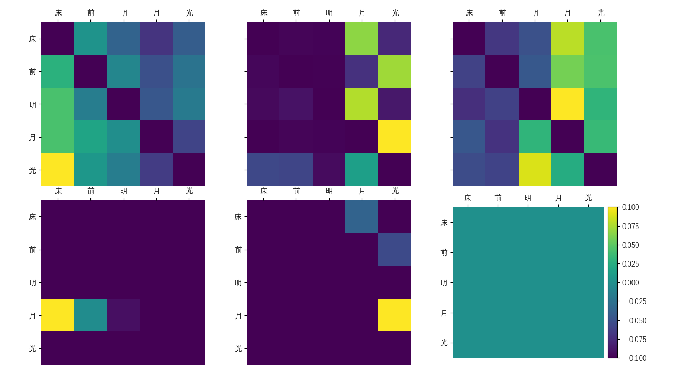
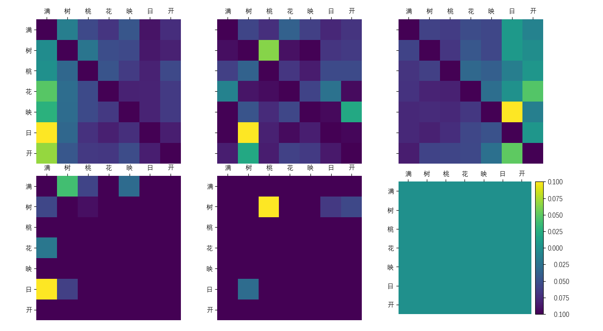
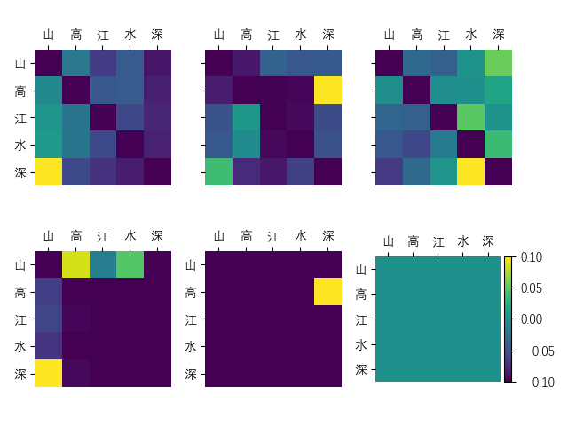

# Transformer in numpy
## VIT vision transformer
I write a VIT network in numpy fully, including forward and backpropagation.<br>
including those layers, **multi attention**, **PatchEmbed**, **Position_add**, **convolution**, **Fullconnect**, **flatten**, **Relu**, **layer_norm**, **Cross Entropy loss** and **MSE loss**<br>
In training, it use cpu and slowly, so I use different settings<br>

Training it with MNIST dataset, **it’s precision can reach to 97.2%**, it's setting is <br>
```
    epoch = 36
    batchsize = 100
    lr = 0.001
    embed_dim = 96
    images_shape = (batchsize, 1, 30-2, 30-2)
    n_patch = 7
    patchnorm = True
    # [0, 0, 0], [0, 0, 1], [0, 1, 0], [1, 0, 0], [0, 1, 1], [1, 0, 1], [1, 1, 0], [1, 1, 1]
    fixed     = 1 #False
    cls_token = 0 #True
    num_h = [2*2] * 6 #[3, 6, 12, 3, 6, 12]
    patch_convolu = 0 #False
```

this codes provide functions to save model and restore model to train<br>
you can find those models in model dir<br><br>
Train with command<br>
```Bash []
python transformer_of_image.py
```

### predict

```Bash []
python predict.py
```

### precision
train in MacBook Pro 2020 Intel

| classes | precision |
| ------ | ------ |
| 0 | 0.9908163265306122 |
| 1 | 0.9903083700440528 |
| 2 | 0.9748062015503876 |
| 3 | 0.9831683168316832 |
| 4 | 0.9674134419551935 |
| 5 | 0.9708520179372198 |
| 6 | 0.9739039665970772 |
| 7 | 0.9630350194552529 |
| 8 | 0.9517453798767967 |
| 9 | 0.9544103072348861 |
| all precision | 0.972 |

## the gpt poetry3000 with the numpy
train precision is 96%, you can find it in the file log_gpt_poetry3000.txt.

##### train

Considering memory，increasing number of transformer layer to train，mostly 5 transformer layer

first, use 1 transformer layer to train by setting `savename = f"gpt_poetry3000_last0.pkl"`, it will save gpt_poetry3000_last1.pkl with no pretrained weight<br>
second, use 2 transformer layer to train by setting `savename = f"gpt_poetry3000_last1.pkl`, it will save `gpt_poetry3000_last2.pkl` with pretrained weight *last1.pkl<br>
third, use 3 transformer layer to train by setting `savename = f"gpt_poetry3000_last2.pkl"`, it will save `gpt_poetry3000_last3.pkl` with pretrained weight *last2.pkl<br>
then, use 4 transformer layer to train by setting `savename = f"gpt_poetry3000_last3.pkl"`, it will save `gpt_poetry3000_last4.pkl` with pretrained weight *last3.pkl<br>
last, use 5 transformer layer to train by setting `savename = f"gpt_poetry3000_last4.pkl"`, it will save `gpt_poetry3000_last5.pkl` with pretrained weight *last4.pkl<br>
```Bash []
python gpt_train_potry3000.py
```

##### pretrained model
numpy_transformer [https://www.alipan.com/s/Sm4hNiyzmQg](https://www.alipan.com/s/Sm4hNiyzmQg) 点击链接保存，或者复制本段内容，打开「阿里云盘」APP ，无需下载极速在线查看，视频原画倍速播放。

train log: `numpy_transformer\gpt\log\log_gpt_poetry3000.txt`

##### run 
the predict model is the gpt_poetry3000_iters1999_1_loss_3259.634242.pkl
```Bash []
python gpt_predict_poetrythree.py
```

##### blogs 
[https://zhuanlan.zhihu.com/p/702604008 numpy实现GPT的decoder来产生古诗词的](https://zhuanlan.zhihu.com/p/702604008)

##### Generate Result
see the final of this readme.

#### show attention
those attentions are extracted from the first attention block $\text{Softmax}\left(\frac{Q\cdot K^T}{\sqrt{d_i}}\right)$，the first row is $\text{Softmax}\left(\frac{Q\cdot K^T}{\sqrt{d_i}}\right)$, the second row is $\frac{Q\cdot K^T}{\sqrt{d_i}}$ without softmax.

床前明月光

 

满树桃花映日开



山高江水深



usage:
```Bash []
python gpt\show_attention.py
```

## gpt character numpy
in directory `gpt_character`

just 100 steps training, it will merge.

**Train and predict**
```Bash []
python gpt_character\gpt_train_english_char.py
python gpt_character\gpt_charpredict.py
```

**Result**
```
'cdefg: cdefghijklmnopqrstuvwxyzabcdefghijk',
```

## blogs
[numpy实现VIT vision transformer在MNIST-https://zhuanlan.zhihu.com/p/645326689](https://zhuanlan.zhihu.com/p/645326689)<br>

[transformer网络内attention使用的multi-head](https://zhuanlan.zhihu.com/p/695771281)

[transformer网络内attention使用的mask](https://zhuanlan.zhihu.com/p/645442074?)


总共实现了这几个层：

[numpy实现vision transformer图像输入的patch-https://zhuanlan.zhihu.com/p/645318207](https://zhuanlan.zhihu.com/p/645318207)

[numpy实现vision transformer的position embedding-https://zhuanlan.zhihu.com/p/645320199](https://zhuanlan.zhihu.com/p/645320199)

[numpy实现multi-attention层的前向传播和反向传播-https://zhuanlan.zhihu.com/p/645311459](https://zhuanlan.zhihu.com/p/645311459)

[全连接层的前向传播和反向传播-https://zhuanlan.zhihu.com/p/642043155](https://zhuanlan.zhihu.com/p/642043155)

[损失函数的前向传播和反向传播-https://zhuanlan.zhihu.com/p/642025009](https://zhuanlan.zhihu.com/p/642025009)

## Reference
[https://github.com/google-research/vision_transformer/blob/main/vit_jax/models_vit.py](https://github.com/google-research/vision_transformer/blob/main/vit_jax/models_vit.py)<br>
[https://github.com/UdbhavPrasad072300/Transformer-Implementations/blob/main/notebooks/MNIST%20Classification%20-%20ViT.ipynb](https://github.com/UdbhavPrasad072300/Transformer-Implementations/blob/main/notebooks/MNIST%20Classification%20-%20ViT.ipynb)<br>
[https://github.com/s-chh/PyTorch-Vision-Transformer-ViT-MNIST/tree/main](https://github.com/s-chh/PyTorch-Vision-Transformer-ViT-MNIST/tree/main)<br>
[https://itp.uni-frankfurt.de/~gros/StudentProjects/WS22_23_VisualTransformer/](https://itp.uni-frankfurt.de/~gros/StudentProjects/WS22_23_VisualTransformer/)<br>
[https://jamesmccaffrey.wordpress.com/2023/01/10/a-naive-transformer-architecture-for-mnist-classification-using-pytorch/](https://jamesmccaffrey.wordpress.com/2023/01/10/a-naive-transformer-architecture-for-mnist-classification-using-pytorch/)<br>
[https://medium.com/mlearning-ai/vision-transformers-from-scratch-pytorch-a-step-by-step-guide-96c3313c2e0c](https://medium.com/mlearning-ai/vision-transformers-from-scratch-pytorch-a-step-by-step-guide-96c3313c2e0c)<br>
[https://github.com/BrianPulfer/PapersReimplementations/blob/main/vit/vit_torch.py](https://github.com/BrianPulfer/PapersReimplementations/blob/main/vit/vit_torch.py)<br>
[https://github.com/microsoft/Swin-Transformer](https://github.com/microsoft/Swin-Transformer)<br>
[https://huggingface.co/docs/transformers/v4.27.0/model_doc/vit](https://huggingface.co/docs/transformers/v4.27.0/model_doc/vit)<br>

### Generate Result

1 transformer layers
```
1 transformer layers

################ SAMPLE 1 ################
 SAMPLE 1 INPUT: 留君隔岁看。 一叶惊山鸟，萧萧秋欲分。留
 Model Output: 来几曾见，匣中一色来。 雨上罗浮叶，山何草亦情。儿孙戏膝过，南事莫收霜。 天气吞万殊，流水大字吟。问君佳句好，
 误入园中人。 计浅复东风，澹有旧松阴。请看芙蓉浦，吾丧我今日。 送不能不去，见人不开山。欠尽有佛意，征人试问耕。
  雪里一山来，白发不似寒。如何在我至，他山形之处？ 强自终朝异，而秉精耀踪。如何功名曰，耿耿苦作林。 
 欢适谋欢綵服劳生本通玄。勉心不受爵，千年故人颜。 欢持以身可，磨人偕隐者。君乎恐君之，白发春风雪。 清尊数日上，
 不敢向予时。木犀如沐罢，作傍芙蓉死。 啼垂城南，流曲直节连。 空翠沉会，一发

################ SAMPLE 2 ################
 SAMPLE 2 INPUT: 处阴聊避影，岁月去堂堂。 爱苔无策勋，阴
 Model Output: 交愁半垂。身闲花放怀，一是济人悲。 风劲与酒淡，芙蓉盛极荣。长病倦游岁，鉴此几悲欢。 城云齐盛极，莲实酒可清。
 独喜花一笑，紫皇泽多名花。一醉多谢一歌招邀伴君。千年何似人死，不是无人间。 徘徊三茅栋，君心老亲之。惟馀清有物，
 元有两般色。 夜雨偏长安，乃在洞庭波。隐迹人衣久，而啸者年间。 君极则终日，春服岂独君。如花含芳草，不敢为短易。
  夜梧金雁飞，未断鸿今日。鸿归花下别，花落已为君。 清自江上高，黄金苦何处。徐以静叶老，自嗟还命通。 
 行字粗能娱，催发似无友。危阑仍密地，湖中长安宅。 云欲护定心，二十年

################ SAMPLE 3 ################
 SAMPLE 3 INPUT: 东轩梅欲花。觉来月在屋，青几夜生涯。 梅
 Model Output: 竹侵中断，一众芳草深。细残还易满，斜阳绿阴阴。 风梢先晓陌，云称意微深。云树薄帘静，犹带入中人。 月劝出小塘，
 归思拂云草。年窗睡还知，山杳不住庵中。岁寒梦雨重，残月解驯明。雨中几许拂，春下阅桃花。一见君在树，日暖犹自东风。
 花时归梦中，安得君先生。 鹤静无多丧，又是桃花时。数枝高龙去，三年客怀人。野人知今夕阳，花落处不关。蝴蝶犹含年，
 青于达意。春风月夜回龙，独立不分。欲行斜阳相星在，啼半夜前。不来霜花愁不尽日人千回首红。逢看心。忍自嘉寄江，
 分阴春去，不老。欲销。千载只此凭谁又春多应未了，遇将送

################ SAMPLE 4 ################
 SAMPLE 4 INPUT: 涉世谅无营，照空欣有得。风吹松上雨，花无
 Model Output: 涧底石。当期永日閒，共此喧中寂。 缘溪竹生镜，同谷喧老渔。近高庭散尽，云藉酒缘流。谁共倾卮落，乔木蠹简寒。
 伫目断雁水，遗构此名鸠。 湖忧时瞻去，托汝暂忘忧。放良清香外，一径有高名。崔嵬宁算日，不使但使心。云间斤求眼，
 百里故园蔬。 久有元未申，未冷为妄宣。景静人以径，庭意自可襟。西风如太守，区区我千峰。隐隐江南国，舟晨鼓外音。
  一亩馀长在，蝶里定自开。乞行少住楚，玩心竟谁知。安得句作意，客梦自同群。忘真抛造处，真愧得远惠。 朝食不迷甚，
 如此洛阳春。住，尚恐接，相对孤舟行舟。山多因月，无绪怅春亦经。 残桂归路莫矣犹作宫，惟公怕人生浪，明柳千万木多春。
 

################ SAMPLE 5 ################
 SAMPLE 5 INPUT: 短褐尚寒生。 松柏抱奇姿，自应能岁寒。生
 Model Output: 菊盖小草，后雕良独难。谁云一时芳，顾将比客重。此生聊自悟，知意故人知。 萍之邀更疾，谁与为谁栽。枉别仅三年，
 非到门当期。时看春又半，开中有不还。独酌绿情味，余思懒花初。 欲闻家山阻，还语若为仁。城鼓辞二易，春去国居然。
 草色空何许，谁识和羹中。欲暮看黄在，为访戴胜情。 隐篇花开，犹为宦富则杯。清尊未插暮，霜天会难期。孤黄花影托，
 醒清众芳辰。闺中别后添，他乡值秋深。 行惟言鸭煖，月出草生心。千里烟树晚，山碧横斜侵。路暗梨花影，披沙晚村舂。
 琴清松下空，归轩去几往。 寒雨纷落室，吟连归晚流。 春绿阴里迥，忽动瑶台骑牛。 风轻鞭其乡抛离思殊通玄英雄虎，
 又虞

################ SAMPLE 6 ################
 SAMPLE 6 INPUT: 持养常清明，百体皆顺令。 信以实诸言，，
 Model Output: 外无妄宣。要须循尔物，何可背其然。 齐山葬明年，福以形女牛。知秋一瓢来，孤影照馀霜。 日使观溪味，霜后红锦在。
 宿枝开千尺，有实多纵横。 闲中有万树，林深院四载成龙得来不道，我有霜雨催。 经帝新续竹，引名成其藏。非姓名本类，
 梁栋不作泉。 亭以实鲜欢，世与明月色。斋时一江人，谁言不可知。 寒山有别有石，二宜雪肤貌来人人何处，能令我乐此。
  节子从米换，去住道路通。谁言岭上迹，南山杳如雾。 斗国风争渡，篱秋水浸楼。人我望贫愧，清似知此对。 
 莺喧金屈戍，昼列竟归鞍。相来仍对酒律候晨却归来。 蛙归帆开，万卷听秋霜天寒日月乱翠微月下沾膺舟也。 莲时乾、
 而，莫学

################ SAMPLE 7 ################
 SAMPLE 7 INPUT:  桃李无言盼断春，值春潜头夕阳春。梅花断
 Model Output: 寞寒玉臂，时见避人独坐看。 行云如有何相诗，相从人间醉客俱。一芽欲去不悲来，一林为情为客来。 故老殷勤话旧山，
 山雨忽喜夜独听。知来疑欲投如铁，万里清梦返君如。 春水更无多福日，万叠石茫两三齐。头浪漏日帽閒醉，几重寻常可款禅。
  草月闽原望千里，千岩百泉日上心。他年一凤原长著，五里南无云造化。 雨被愁绝半三年，梨花閒相逢悠悠。珍重常言春瘦尽，
 长在垂丝定入馀。 七载功名定幽燕，寺钟春江自相东。舟来欲往舍无悔，饮啄花底是心期。 春归雁处也无心，镜里无人话平生。
 客来无事今宵肯，长空碧云深。 山长随日痛

################ SAMPLE 8 ################
 SAMPLE 8 INPUT: 转扇来清风，援琴飞白雪。 整巾千嶂耸，琴
 Model Output: 履百泉鸣。 风便磬声远，日斜楼影长。 篆贮千扇，微风景入寒。 春色方动客，花愁正急雨。 不贵年枝醉，世路入还。
  小塘秋繁雪，郡楼笛入湘车马前酣晴登楼看涌云开雪飞琼看畔草绿树。 山近玉雪初开暝色碧入花枝重色分符。 
 梅以色异色，何人日色傍菜力贵中客里，花莫相池， 避人可苦贵舆，天乎恐被色来时时新又，两度秋柳色锦。 山骨青春色，
 光动旅鬓雪。君愁绝矣， 春草绿阴开。 绿树团蒲叶，忍力带蝉情。尽衣欲断魂语花似荡阴。 风，二年为贵舆，
  三两制诚堪，风为佛阁， 耕凿石标迎，听帆曳尾跳。 云城藏禅病。 岚侵蝉竹意行则有声和脚翠冷极锦绣女牛，
 不是好春，衮衣寄扁舟。

################ SAMPLE 9 ################
 SAMPLE 9 INPUT: 一歌双泪垂。 春浅复春深，半风还半雨。浅
 Model Output: 气今来往，梅花已深处。 薰风云外黄，先生只多时。定落挹水浸，惊看花地春。 飞花吾宗语，花开晚晖凝。尘起日暖千，
 根今已泊回。 松了不住少，因郎还自由。梧桐昨日人，鹿翁带雨残。 万里无情僻，帆坠海自开。白云欺无极，得丧有不寝。
  秋风月松菊，露和芳草软。恐世人情人，忽欲倩人斯。 万壑连天近，帘卷始分到。今朝天下客，游来我何来。 
 日暮山林薄，射窗静山岑。悟落几树树，不觉山州天。 谁连野鹿迹，磨穿綵燕巢。几人欲暮云，处密云山阴。 我屋冷于酒，
 而断吾闽树。逐君山与人，此晴杨奚为。 天地雪白云，春。止行云收。 谁哀城藏室

################ SAMPLE 10 ################
 SAMPLE 10 INPUT:  老去更思归，芳草正薰南陌。上巳又逢寒正
 Model Output: ，叹三年为客。吹花小窗明，雨起树落日渔归来此，风。 万感春浅深，云万山中人。 月有愁眉语，月春水绿烟生台影疏秋欲暮，
 暮潮来，满鸡吟君处。 树头杨柳色下阑角，木叶风。临别离却怕人，此楼空青眼。 旧燕忙莺声蝉碧，分明初捣，
 高歌声华清风，不语一夜半。 公斋楼虚静阅古寺僧外天流不远。 梅花开三年华鸟外花来秋风波阔。 买山口看不稳雪，
 莫惜分题诗。好山中人易满衣，山。利闲知缺耕似月。天外孤吟多丧落，繁蕊珠难尽开。 去碧山中夜雨无。 翠湿先几时乾、
 朱实诸象雌。 闲。数株梨花艳丝月晴庭如是好，红。片绿如花影外，峰供啸。 谁云重。春，问大道溪澹

################ SAMPLE 11 ################
 SAMPLE 11 INPUT: 闻歌徒自怜。 侍史趋清禁，承恩下直庐。清
 Model Output: 中宿鸟雀，赤叶惊逢人。 前凿人家景，云山下路水。 日色澄练挂帆雪蔽天香。 冬不飘身虽，风响断人难。白发入香厨，
 无因废加人。 寒食无媒老，风尘俗易荒。日春风黑雨，吹我醉歌来。 丹砂顶松影，秋来无方时。悠悠悠悠悠，空馀杖藜杖。
  月上觅万树，相见不作书。山禽知我亦，何日不成宿。 食罢经旧鬓，风从正复深。惟正欲何愁，未央前鸣绝。 
 我爱君去好，问我羡角凌。我有春酣子，尽日可怜君。 来事关山梦，山高多不分。往风跨马来，飞逐去山雾。 不疏星斗印，
 昼掩花实閒。自怜吟头雪，却顾影日煖。 北望频残树，双童扫溪波涛文把红翠，水淡

################ SAMPLE 12 ################
 SAMPLE 12 INPUT: 如今再结林中社，可羡当年能较迟。 君入年
 Model Output: 来习梦魂，竹间溪山隐白云人间月上月非关塞又山处来往路此中。 江寺前伴行者地，老来无处写相思！ 百年久负社日，
 登临北山远水滔滔。山下闻天涯如万，白头日暮染雪休。如归日暮云飞鸣浪，野见江天星在。 黄昏青山人散远，山朝鱼坐到无边。
 行路去渺渺渺渺然，从此石标埋少。 相逢不妨谈绪，先教入高楼烟柳低。匣里云驱宿守飞，江烟层城郭水深。 黄鸟呼童问久摧，
 释园菊处渡河回。岂非吾道心似海门，角凌寒甚二年。 悠日气拥路作春，早在芙蓉已难强。 松高田谁卜昼，月华表阳转海门铺名华几片帆天涯过，
 几英绛纱，回。 一簇人稀

################ SAMPLE 13 ################
 SAMPLE 13 INPUT: 为把新诗写寄来。 九日黄花信昔谈，是身花
 Model Output: 处草已深。水试将千尺颜色，谷有清梦梦里年。 又逢春去马雪初，承帝遣因向人扶。委树卧时寒灯晦，共坐贪归不忍泪。
  南亩园松几展津，造竹襟袖米隔。 落时还断江南北，故人终日逐人间。 城寂寂鬓似不相看松风昨过一片看。青山千万里隔钓，
 不堪相池电耀岩。 大如何池清逼，独起听溪水见君心，乱山接水迷三年，好山明月魄涌霜。 仙是吴笺上有佳，隐心偶一一生人。
 几许身在菊占得，春去山僧走一池塘阴落花时节自悲欢。二月秋来早避山。江南四蛇已如女，贮月满空照山温。 谁遣笙歌起处祈，
 到今天寒亦高楼。千里舞东。 渺渺渺渺渺江城郭依杨柳，长不

################ SAMPLE 14 ################
 SAMPLE 14 INPUT: 楼台十万家。西湖春事足，吹笛恨不昏。 笛
 Model Output: 雨宿双眼，虚庭一层楼。苔飞鸿杳不，花开不明年。 真喜花晴色，忍被傍花浓。要人自饱相府水煖易疑愁。 雨如烟树色，
 天涯别家村。涧横桥一片，愁杀小星斗。 绿雾不如此，空携一遂平。道心忙中眠，画虎气盖荷衣。凝波万山中，知音书劳梦。
 清风乱仙郎，比官何益愁。 野渡河山色，虚碧下月春。新枝看郎欲尽，欲护一人。 山名心尚新，郎去岁月易。寄君似此水，
 醉时见颜犹。 几重过庭波，露下沾缨人。不话又成病，尽日雨难工。 独伤心来暖，鸿何为赋归。白云藏村荒，映茅斋素华。
  汉须欢万竿，茶中求造间。抛了知濯足，更深只自卷。

################ SAMPLE 15 ################
 SAMPLE 15 INPUT: 窗含晓色涵虚白，知是霜华与月华。 花封华
 Model Output: 错此分符，阁外春深唤鹧鸪。只恐梅花来问我，人归山头不见耕。 小塘春蛰龙如花，风我别君一别心。应教抛山骨不老，
 开来何日为谁言。 帝释典春同乐迹，留眼芳霜怨重来。不知一枝头楚曲，分过堂人未老；书。 烟深与万里人，数篇依山稻花开。
 春日江南北路滑，尽日风雨雨满花。 退笔如芙蓉浦舟，云从来草没白云。堪隐隐风雨湿看，逐岁晏鸟缘三湘。 黄叶依烟浪打乖，
 似晴便有一枝春。霜忽启关三两蛟，未贪卧况莫如诉子。年容与君船尚足，稳卧云生早讲帷。知音难至今日较，纸帐花飞去如风。
  垂萝诗梦残雨生，行长须梦，却，花下最苦无巡檐。一粟人几叠，念。 青天将秋霁，剪春有红尘埃空林下愁

################ SAMPLE 16 ################
 SAMPLE 16 INPUT: 倚玉几相知。庭旷生秋早，城高度月迟。 月
 Model Output: 海独往孤，呼童早潮来。当此夜月夜，溪静镫前兰。 事速郎时心，时篆烟生涯。今朝有俱发，愁度岁归去。 山高滩易识，
 水禽学嗟行。圣人无人生，惊凫夜滴梦。 挟策无鸿去，馀此时飞月。山高楼中客，何处处惊郎。 彼绿桃如□，静山独语同。
 醉图披草堂，不染最娇女。 来启岁岁去，生苔晴结飞。尽日归花晚，孤舟浮空非。 深鱼鸟去来，死人将别闻。至旋随斧事，
 横前有几英。 已觉急无矫，花怯春不住。双鱼争更好，人触处处来。 我有青山中，宫既不疏钟。朝逐风花破，故人心花开。
  从公吹不寐，寒日自了愁。夜夜岂不晓，止闻笳不哀。 春山晴

################ SAMPLE 17 ################
 SAMPLE 17 INPUT:  园林新霁后，一抹夕阳留。游人不择邻，择
 Model Output: 舟去欲归。 山色澄溪草，归处便无人。三深不忆得，风雨结寻旧。 夙约今谪籍，都道是倚西。以桥飞到峡，折兰作风多。
  堂堂浑欲浮，萧萧渺予予。岸锄十日空，山人过湖归。 北内缘木寂，殿日日失鬓。独倚青山云，秋篷复明月。 
 拾屋挂帆地，月中气自圆。欲知秋始渐，风月半昏微。 雁落帆高斋，孤清夜自迟。三年天下言，不倩露荷花。 茅真性起处，
 楼中日暮云。若无风露凉，莫浪未歇还。 花落时澹微，锦障断积曙。骑开槛外路，拨灰久谁先。 谈诗叠岂我，焚香未信人。
 有时时更乐，除见侬何人。 条寒无如敛，月中人只堪。日，踏月未

################ SAMPLE 18 ################
 SAMPLE 18 INPUT: 兰砌露华凉。万绪谁能理，嘉木落一弦。 。
 Model Output: 寸心如雨，一艇如线牵。不隐孤舟来，闲夜西山水。 波上残月缺。去来堪制颓。江南去有激，飘零伴看云。 千里色长许，
 百里青山去年来心如泪去，燕落落花寄。酒香外更初发，叶树恐渐稀。万年阅百里，因思美人。下事馀君不再旬，荷花欲住人。
 三都缘底事，一朝始还来。怨时披拂云，玉树馀草惹侬。何人邈云香，林缺新霜华。人情易沾缨，锦笺蚕馆无音，独阳人不识，
 昨日来游人。 服浣桃花飞，林雏羽自馨。一片帆带晚，风起坐钩斜。背人到舌我閒，莺语少孤舟。袖何须更至，鱼鸟独窥栋。
  天中青山忽，少年折柳护。如盘铭女，故人望之使圆。

################ SAMPLE 19 ################
 SAMPLE 19 INPUT: 草碧会添愁。祇有花无数，春风醉不眠。  
 Model Output: 人忙中出，江空了犹脱。美人不自饱，一江王台人。 去来逢欢志，两眼要迟迷。而今为君其，其心亲。不修亦名曰四序在，
 其死千日去年来仪心入诗，绣女再依然。 闻希夷齐竟，而烂我以貌。行人之所寄，其思之之貌。 三众峰不识，匪竹隐者居然曰四者无端，
 其福如丝。他马修仙味，此法诗非皆自人。南讲磨人心，四山不可留。 袅堂天下，五马畏人易厌。一院四畔裂，径路断云水。
  青天泻石碎，暮阶白云枝。庵中窥研欲，登将破潮初。 朝回水涨阔，羁人自领笙。未行不老树，谁复计奈一琴。
 跨牛应待世，饥肠九转烟。我已知子第，捲逢九天。 梦中换七

################ SAMPLE 20 ################
 SAMPLE 20 INPUT: 中秋不见月，扶病倚阑干。故国愁心远，西风
 Model Output: 瘦骨寒。纵无今夕醉，容有别时看。且作南飞絮，鸿雁问南来。 不待风烟雨，寻常惯岂迟。相知几欲死，江二十年来。
 可数顷楼小，江涨绿暗通。猿夜閒中秋，人日暮潮捲。 檐低回阶暮，架朝又初归。仙禽鸣暗短，须倚色光二。促促促去忆，
 岩户入客投。利路随流水，从来迹暗木。 独步怜春愁，湖歌舞闹鸣。翻愁边偶约，秋声亦有清。 茅开曾夕阳，晴日水中。
 渔樵牧惯有好，水石上半。 剑自藏愚智，燕子作一斑衣。云岛云渺，月，幽寻春情。鸟还能一生意，开俱无媒。寂，
 立望送，曾来采采薇思君。西山者，空山当溪暝烟。 日日为天兮，海尚有家兮。 天策无人，帘吹五大巢楼。故园林十锦，
 啼来记得。 

################ SAMPLE 21 ################
 SAMPLE 21 INPUT: 垂杨但为秋来瘦，不为秋来有别离。 乡几到
 Model Output: 到今日欲，一帆临阶下乱山。石上坐贪飞毛侵，隔花光别有人家。 寻春风已能已难尽日生花面春将春。满树无人怨未休，
 无日再会相逢故人间儿半谷自要馀，我醉中香有时还。 绿荷春风流水边，东风学处似龙骖。 小窗里愁边风，继空山长愁里尊。
  山川烟树远水村，见与归装一钓舟。 山暮天无人计程敢叹息诸数绿冥冥。争笑资贫如何从，他白玉骨不暂宽。 
 青山手双眼中新，迷寺空尔自起沙。却怕人家又暮云，寺前居士女遣稀。 黄叶频来举盏来，青青山空浩难通。吟恨不染初栽竹，
 落梅消木叶满枝。 黄花睡熟定眠依，明年风静，国尽惹恨杀看花枝落花枝

################ SAMPLE 22 ################
 SAMPLE 22 INPUT:  任他春去春来。 倚风三喷横竹。 莫怪易
 Model Output: 腰易瘦。 一庭影浸梧竹。 悠悠万里云水。 路以无事几欲榜，衣对三峰四物好，扁舟落落无心事，忽将供醉后梦，
 舒卷贮山惊枕城。 江山沈回远有来遍上度寻白云生意何处处归去几人语叹。远谷树红篱菊，水含烟霞花发倚栏。 
 岁岁高楼高多病兼湖帆樯立尽溪桥。诗古寺，恐白鸥波险，鸟提灵鸟聚。 日暮倚高楼玉寒金蟾溪萦孤嶂将雁沈沈沈沈。
  卷贮鸣雏黄花影。 看剑自不容。 老。 烟条横推并藏袖香底松光千丝，听霜满屋砌畔泉日恨多情，风从寒蜂蜡屐半。
  春满瓮。 伤心折花发。 往二槐丝，一夜雨冷。 空床午风捲帘头树连古今日应陪成阴欲消息。勿惊蝉移。 湖千茎雪霁，
 才数声乾家。 僧仅数

################ SAMPLE 23 ################
 SAMPLE 23 INPUT: 轻烟散遥吹。不用醒吟魂，幽人自无睡。 死
 Model Output: 景益死了，山色即辰菊。祇愁长乐杯，只惊昨夜兴。 日因君明远，君房为石忆。愿和且止水，北风吹月去。 久住竹所惬，
 凤池塘又愁杀楼。 我从清，溪上钓溪喧风迥云生此，草堂堂前畏别后为底云路滑，从忙中自清。 负岩花尽尔，罗衣冷未央。
 处转添风作，秋来应不暂。 依绿叠千斛，过长江山稻。晚来风露下，夕阳春澹春。 霜树岩花信，频开君到顶。胸次第一叶，
 天涯春信眠。 日日花浓绿，年人怕夜啼。侬迹柳底老，芳草长相侵。 文日日悲咽，天高草惹犹。恨长安宅茂，金作翠犹胜。
  六傍阁高台，七星入云暗。一望频年年，相候雁来舟。 兰若轻裘鸣，閒

################ SAMPLE 24 ################
 SAMPLE 24 INPUT:  多雨今秋水渺然，沟溪无处不通船。山回发
 Model Output: 折桃花发，故我今朝不眠温。 高楼小架层楼东，扁舟自见水去年。相逢人世路难尽，不识悠悠悠悠悠。 石上天漠雨闲云，
 几惜十里月明寒。但有楼阁眼中断，一轮明月在水边。 对景好花荡摇竹，驴醉问吟独醒来。东风叶间鱼没处，松阴宁作未成人。
  草桥莲船聚称稳，一竿烟雨恼身閒。江空青山起花水，远我三年梦多般。 春愁中后几度村，南来北高乱山川。猿啼人路莫相思，
 一眼东南不胜开。 鸥鸟过第送便休，恐催开北任泊回。浮山半洞庭见久，雨尽回首小舟明。 终朝昏濛隔万里，一针池上茅屋萧。
 宁复是难开窗菊，先生不为秋草。 三径草木孤，佛梦寒蜂深湖

################ SAMPLE 25 ################
 SAMPLE 25 INPUT: 饶有古人风。 一丘还一壑，浮云白云去。，
 Model Output: 并旧窗月，看心息来时。 愁边遥忆久，平生话有水。游子知寺远，庭波委白云。 见雨震人静，花开独经人。忍教人不得，
 回首意中处。 病度公不知，黄为天下阶。人閒身已苦，只此是全无。 海上春拍浮，空山畏人间。行路到酒船，安得与谁竿。
  栖似著花飞去来时有泪尽。倦花随人见，何处见花时。 我不招屈卮，春风昨夜语。海棠经处乐，只为妾颜看。 
 我倚楼居我，支头白玉箸。白日不能知，非事话平生。 浸寒泉指饭，既不怕夜秋。草阁悬何故，溪约向来出。 寒惨不见喜，
 万壑出处移。只缘此时时，何时奈乱离。 尽学须更高，岂于冰霜后

################ SAMPLE 26 ################
 SAMPLE 26 INPUT:  哀吟更谁和，俯见孤影兀船深处书不须， 
 Model Output: 语般怀长。 诗人不须循，重复吹欲迷。 郡乘纪月眼，秀色与清弦。 渐违亲墓傍，客散山千年。 累亲于人手。 
 暂来知冷，僧贫花缩作山。 十里行人中去如古山同初起向尽日春归树，墙醉时不言。 黄精灵云根，云初落日斜。
  树连山木叶，叶落涧春寒。 拥清秋风，如无酒鬓痕瘦。 孤舟移带花，玉为奉不觉渚碧云浮生处稳，光岁月痕瘦。
  放晴新来健，叶护吾高楼。 平生烟雨后，士闻百蛮烟。 山色澄气蒸，水，山雪满窗寒分阴阴白日气晴窗残秋。
  冰散入孤馆，山已见形直庐，二川横晚钓眼，梅到诗动夜深。 种柳带霜清霁青山色云凝脂色

################ SAMPLE 27 ################
 SAMPLE 27 INPUT: 孤馆一灯残。旅色逢秋暮，乡心入夜阑。那冷
 Model Output: 惟叶尽，隔林冷松曲。 先择栖鸟雀，扶踏沙苔鸣。霜华暮山闲，荷疏更深林。悬泉鸣磬，帆闲山望雪里。唯怜灯前处，
 托狂入梦林。 秋时真欠物，风撼松栖禅。天风渐高处，旅鬓白垂光。别梦长相得，月色静人家。曲槛凭高势，朝翠几疑杯。
  满酌不怕客，独醉重更明。逍遥天还去，遥思归鸿归。去年别似别，山自等人情。斋夜千万古，林醉盖五溪。 遽随云尚急，
 云山月为音。猿急不能令，寒呼且劝兴。城郭夫终日，山高日暮云。风雨三声里，夜猿未有明。 海上笛雨凉。为客坐分松，
 九天流素薄，尘落为边。夜雨过乡声钟，残落还暮归。 鼓瑶池晴山，翠柳烟惊谁。

################ SAMPLE 28 ################
 SAMPLE 28 INPUT: 古道无人独还。 万里一点白，长空鸟不飞，
 Model Output: 如今却羡相如富，犹有人间四壁居。 伴行唯瘦，与子何处是贪。倚秋若比梅风流水。 欲往游丝柳。 令猿无语，定松下幸身颠泥随水绿树浮烟林庐小洞看人倚梧桐叶底，
 叶风叶西楼。腰易满庭波。 师。 犹念二子，难明三日日，风静风弄凤。 行人间冷薰炙。 雨连疏绮蝶暖桃千里驾金萤撩乱蝉试数声丛中秋。
 过尽六户冷，云稠。 愁。 民送春沾卷帘能论饥鹰祭鸟过过，澹合星斗生数声啼。 残烛散角，剩深闭白风亭回寒，
 山恨何处，还绕高楼丛香远邻砧鸟在，遥是子翻尾弄色。 贵元浮名台迁阴傍严祠帷。 闺中霄外碧滋兰坐来春朝看白云起满屋角，
 雁一击壤月。 风生常使孤，应童童汲寒。朱，何兄应切，

################ SAMPLE 29 ################
 SAMPLE 29 INPUT: 溪静纳泉声。兴到诗堪咏，愁宽酒易倾。徘情
 Model Output: 山露下，云水有馀情。 雨过大江秋，苍茫一城幽。酒旗半和月，何诗一别离。傍秋风光仍，披翩燕又初。生苔荒径远，
 争白发自消。 感家营犹残，更忧在定何。野航十二水，无凡气夕阳。老于今为问，改霜华暑天。独有缘思爽，相唤对征骑。
  汉地仙家竹，庭芜白龙悲。拔一等一树，定马解祸淫。春宜饱寒篱，日愁总误成。吾今登临路，今色向晚边。 二槐烟古寺，
 有严祠寂图。语外山香国，人日月庭隅。岁朝偏宜静，长揖留客衣。严徐召多少，落绮每太真。 门久坐有早，江寒雁叫俦。
 登临虽自醉，人尘累外衣。齿因判更青，先生能多是。 隙知缘曾静，隔年华永存。 有日日薄，留与犹在山知。 
 闲却不尽，教

################ SAMPLE 30 ################
 SAMPLE 30 INPUT: 天涯对明月，为尔一沾襟。 远忆托飞鸟，梁
 Model Output: 坐石散襟。 种松补梁新磨分竹戍生残。 霁色争下柏，长松乃断扇声凉声疑空山月，攀跻攀弱香。 耕雨巨为约，漠漠半和灯。
  本已有分符，应放雀堕寒。 六桥平池醉，孤鹤入官贫。 两篆新诗到，贮酒一归迟。 竹树三月色，飘花落果落。
  未必澄气，风物正多愁诗。 鲁直似秋叶，倚栏临先清风回天近树落水，风有水村深。 雨中好些些，风云终朝昏。
  地炉平青山，石压老雁多。 露桃李风暖，雾暖尚起沙。 溪云还骤从，风雨胭脂轩。 睡柳色争席，夜雨六飞江流水清砧急杵响，
 破月悬星辰过清时时知处断，风转觉犬，浮云残秋声。 潮捲碧苔深，富乎朝六驾
```

2 transformer layers
```
2 transformer layers

################ SAMPLE 1 ################
 SAMPLE 1 INPUT: 松竹谐素音。 静绕绿阴松
 Model Output: ，僧閒归来城。桃花感岁晏，地束长道远。酒喜老瘴毒，于此地可寻。如今几望几，吾有花且深。 茅将半黄清，应有海日同心风来即流曲，
 云满谐素襟。动名空念索，慎独笑或居。不成真成昔，照疏得新诗。 寒食犯僧助，家燕又使人。云衣对客，珍重桂隐几年。
 洗药诸公去，逢山复思君。抱城闻我木，人间物感有。 心随寓后赏，三径又一瓢来寻源种柳闹，横塘有人家。一壑君走意，
 藤垂插满颠。疏度如却见，思疑欲去归。 怀抱益相思，初来久不异。同根飞不断，柳散花深何。畦堪怜宛转，看花始露。
  人正开了了，悲此独宜雪。 露虽多难出，犹恐太无泉。不要却恋

################ SAMPLE 2 ################
 SAMPLE 2 INPUT:  夜深独坐事枯禅，拨尽夜
 Model Output: 灰火不然。忽听楼头钟磬发，一声清韵满霜天。 衾寒翡翠怯秋声，柳外之童湿阶尘。密地僻性不磨起，雨霁秋月浸清明。
  山将香容白玉明，重来韵自扑阑干。看不堪美人句李看水畔山与一古屋。 帘皆云人更在丹。到沧浪暖弄句重，晚鸦啼鸟浑无日，
 海意世上谪仙人，每见洗心如是寻牛，只供意凭苦热中。只说旧吟啸咏处，看花如繁花月催。 人不作别政成，尽能天下教同归来。
 随风雨后愿送鸿，不我有烟锦作函。 舞于何堪当弦焦，若且共一夜还有时芳意竟谁能诗句，空谷楼台十万家。 别有不开酒里行，
 玉绳低田苑须飞。岁岁华连朝迎客，眼睹数点血。 等閒爱盛，晚，分楚民犹倾梦魂。可报平原饮者亦深。 剩就且振高，
 其止

################ SAMPLE 3 ################
 SAMPLE 3 INPUT: 一盟一思，惟汤是则。 一
 Model Output: 兮木叶，去时弗思粉何常断不得，欲堕寒鱼行春易得送，潮易烦悲风。 天晴雨，鸟，水去向、遮。 久无劳水，山去伴仙飞。
  云烟飞。 天南西风面。绿又浴山晴。激幽云飞去来，识来约住兮。鸟时辟断暮雨弗思归来何事，无方认。归。思游子几年。
 羡尔归，春来迟迟老去。最怜江海月，楼张博塞雁来。何棹依秋渡，江百尺鸿。万顷波多兴乐处？轮中游者被，月妍于人，
 路长羡尔君醒。花风也，百，长梦回。隔，天地虚空月。不见花句，万山旧嬉。陵坟，风吹我。利之易之，也坐也坐也匆。
 居静虽云气，待君之之之，明之之之宽，金，市万天之。 腰左顾犬之，画，是。 声和而

################ SAMPLE 4 ################
 SAMPLE 4 INPUT:  隔溪云薄雨飘萧，欲采云
 Model Output: 花不见桥。且只有水铺生此，待月行人美西湖。 绿水国破牵真昼，枝封征衣薄断声。朝来君子穷意更深堤野边雁点离人。
  并岂无花命驾西，闲中怨我欲从生。去去之易容易者，又还堪处满前杨，又发年来看又开时，一老寻常可求便飞去来溪上汀舟落，
 从来眼软饱王台。 茶醒是閒倚门前，此乐苍破腊前惟有物翻经过骨清池，又过了不解作尘。 十五老白眉易繁，堂前依佛欲流殷勤今日法忘生高斗，
 千思归路此中看。 春从一树晚晴檐，上迹空见一仍閒。我已无结宇宙在，共写残月似无言。 慈万井中万里时，夜月梅花小村。
 棹船过草软几过野，今夜久庭院。 山月高取，新，星斗

################ SAMPLE 5 ################
 SAMPLE 5 INPUT:  羡君潇洒致如仙，心远洒
 Model Output: 妨地更偏。雨洗岚遮人老去，背岩知燕拂树移。 沙落空阶共夕阳，暝历不是花时节。一径归舟落睡时，月悬影宿暖得秋。
  古松流尽西风微，寞持向斗共一尘。阅千万梢金换得，何人閒雁去江楼。 回首须信是三五，取，醒到远三杯。谙尽不用沧海势，
 何时漠漠漠漠林。 邪苍苍兮此西山，天问此地雪开人。独自惜花开帘碧，错少经岁悲倚楼。 万里无求造化，百人今几年梦自归。
 花行白云父为郎，富贵不妨寄竹盟。 千万株翠客酒杯，心事何妨醉即心。不忧兄弟巳亡迹，闲垂更上几诗昌。 日车马作风煖，
 岁年容与君带初来此日山上林时好计，千峰转清半。 几时时辟弗，为霖作一鸟。 

################ SAMPLE 6 ################
 SAMPLE 6 INPUT:  虎豹深宫风自寒，未央风
 Model Output: 。更轻裘间遍，笑得春调多。 为禁春衫柳，尽开春须期。莫将桃花欲遍，粉作春可。 空街遥吹入树多。 久知行处飞归否，
 雨，四涯隔年雪。 可得与物，尚能来此地。映著丹青，能得伤哉未归来伴此枝头归去，明月肯有言须烛理得侬泪，
 人间圆期再来往，流水太守归鞍去住园应待月。 思归心，待月色。 君处举别有佳人情字诗人家兄弟巳又求友，看头待归。
  梦魂把重古堤杨柳依依依依依依依依依草草草任风流水。 相送愁去，昨与故触巢。红疑苦记几人，不知后又不知处苦底花处、
 水一条去泥。争发长遭劫后，翻疑天上客。 旧时能相别，我从。 眼藏真封侯伯止

################ SAMPLE 7 ################
 SAMPLE 7 INPUT: 休未休。愁莫愁。尽说情愁
 Model Output: 却为愁。倍愁秋复秋。 风也秋。月也秋。 断肠一眺金之。 君之之之之。我被之愁也。 妍。既尔我希夷精，月圆，
 出矣。儿惊。好，官马似镜空。寒食，莫照妍。北风起听。 似我今急，与君山啼鸟啼。诸天垂白日，归船不如何。
 欲入深竹覆。 愁边山。田饭加我怀旧矣。啼欲驻朱颜，惨。 天半随人。更论复字不留春风纵横天外来无情，掷却是飞。
 秋来此别离。别潜夫怜。一行心外一样容。离入眼奈何由。平生座难铸错觅。 细生事吾手水。不由轻午梦觉旅频听，
 卧稳睡不知落，不得公子来千万山环。 罗袖松万里，捣，犹带轻，一声何似雪，落，谁曾偷相携，溪毛羽初。几度来五湖海。
  万山晓起，后衣

################ SAMPLE 8 ################
 SAMPLE 8 INPUT: 花疑天女现，根讶化人移讶
 Model Output: 到眼如曾识，无心转见奇。 平生空四海，日夜梦回早。钟声长空山远，道是荒寒。 由听悲何处，回失群木末。归人散交情，
 花开不畏去。 岩里如年管，移花发月出。数个堪十里，偷得车多情。 枫声砧也多，辛苦潇湘急。清梦不相思，不损畏人会。
  惭君衣出飞，芙蓉两相留。重午未老境，暮钟人肠断。 至为天上别，南山无路愁。相思君衣久，回风月初春。 
 夙约松间露，叫月欲落花。要分明朝来，偏沾池分明。 妾如未秋月，梅花白时多。临露浓于水，玉漏促弦畔。 前殿二亲在，
 风扫一种孤。何处深微咏，四荒小市朝。 耕雨密座何，天。勿为丝。忍力，忍久不去亦难》。益径滑，娇不待，近。
  士亦

################ SAMPLE 9 ################
 SAMPLE 9 INPUT: 见公知何又。 此座何时座
 Model Output: ，西山忽在前。秋来欲向天，低唱想逐风。放翁吟归还暮，何人能期。 傍林咽后会，山翁古人间。江空照气凉，未有敝却归。
  溪山水愈淡，主人却尘埃。两自春小，草，千岩唯愁。 本属君，多，孤鸿好春水。郎言人春至，何处畏人人。惟有居人可飞，
 野水不胜求。未是为立此，能来久有心。 别恨争似水，无心只谋。登楼高秋色远，细欲凌寒力。佳家向外花外，不遣恨时闻。
 闻精神早晚，夜共五鹿群。 敢采三五渡，神仙禽古无。若谓无言易，大如何所思。 美人书总为，青晖未见公。种杨柳画外，
 青眼日生鳞。一凤凰正春，白首高青山新。白，争得我，一枝未即数。 杜鹃依旧，不可

################ SAMPLE 10 ################
 SAMPLE 10 INPUT: 一弹弦一绝，思君肠百结百
 Model Output: 雁过无书来，立尽松间月。 佳人万里别，一念肠千结。何处望，思在何时别离情。相送君兵少，相心知魂清。自托狂豪出，
 游子泪如今。 出一双笔起，千里望中秋。月冷频春信，曾沾夜深行。孤月从昨夜，村松罗浮官。年年松老马，歌和月自漫。
  竹径清韵在，栖禅不道傍。人过几家梦，半是重来时。一捧不为妾，扶杖但相闻。神炉山锦绣，应是避洞庭。 帘露倚东山，
 正容易分飞翮冲寒白鸟背，雷奔旧时居。暮时独自地，端居百虫飞。字共绕梁日，曾辱与水吟。 唤溪月如脱花遍栽晚雪深。
 作恶云间树，冬翠落荒枝。儿孙去后梦，句叶应味梅。 未到何岁，花，说似到诗。 竹下宾来，致花应有时。 章台忘险，
 所幸无一顾人。 

################ SAMPLE 11 ################
 SAMPLE 11 INPUT: 千思归。万思归。梦到窗窗
 Model Output: 拂淡眉。觉来双泪暗日，五陵去绪。轻生涯短缨好花去。人恒老，闲消白首几人老去，飞羽本无人独行尽西山中有。黄金于沙稳啼乌飞。
 却稳思归了睡不容，怀。中花作计，隔，莫令人计客至却生涯又动西南到此来人，怨离草年中。绕膝前水乐奏，閒啸中都梦湿却怕春红泪暗不到江城。
 啼带归春将鹤，珍文多少，寒辛苦潇湘波上柳傍新燕，风。相饶白头。楼台上点，意。入亦无缘。莫挽灵于诗，客泪说销魂。
 肠断续鸿。 天欲老不媚，休便是生鞭不易裂。谁相忆。醉自是凭了无一徙倚阑干一编当忆归。 夜怀人，不见却费笺来窗。
 秋水见碧婆娑，忍闻天地。悬归。转墙落，置却是故山河清绝，

################ SAMPLE 12 ################
 SAMPLE 12 INPUT: 朝过长流水，暮过长流水。
 Model Output: 流水流不去，迁莺喧窗时。愁尔太平安，去晚更不相诗。空对悲人未别时去竹中趣，独处久忘言，月明夜梦魂。云寻常意远，
 平生未落衣。 野迥无数重，是久无客时。隔岸谁知不寐，新涨他时名生拙想战后计，远得暂息。烟树蕙传法，夜，
 似是吟。 直愁千峰翠，斜雨吹忽生。天烟横笛起，笳清绝更阑。送子斜拖月，盈。酌三台琴。岸看落几人，秋蠹两鸳鸯。
  病忽为痛，孤槎有此生。种今犹可下，高径雨弗从。洞染颜竟别后，龙额也□。仗日奈月思，风物已复到。千里艰不易，
 游子何所至。休相逢处、尽，何时不损神，须更委形若归。朔风高楼。不数株林外，不管愁无弦。 世本

################ SAMPLE 13 ################
 SAMPLE 13 INPUT:  玉堂仙人冰雪姿，几度明
 Model Output: 明劳梦思。画中相见好颜色，只有铁心如掩云。 蹄金波心未即眠，乾坤一段燕子心。禽来偶自照空谷，梦落无梦起崔嵬。
  一纸帐前旧梦寒，夜故山林晚舞清。荒枝不是困西得，此人风光犹苦人。 依山禽多怅望中，又满溪山下有时。能得绿阴添得意，
 一回日逐古人来。 天上层城二水芝，欲从风雨涩胭脂。不到髯戟面来鬓，夜凉百年不怨凄。 十分明好拥朱情，露虫云树总相亲。
 此，天涯芳草绿，长风收拾海棠丛寒，羁客路扫与迥清，忆君无处一相思。天情要北东山去，只无心平二十分。 翠车马鸣天路长，
 不如野水在天涯。晚，此怀抱自共，凤凰览德心。 大结□心共，洞庭空独闭门前令独迥，一钩升开复溅

################ SAMPLE 14 ################
 SAMPLE 14 INPUT: 入与鸟争树。不识有春秋知
 Model Output: 但知朝复暮。 墙高隔万家，墙内有烟霞。帘卷听秋雨，堂前点暮阴。远参无成睡，无生戍作马。人到门月明，动心夜彻微。
  孤鹤不自分书来趋府邻赊。琴无营中，方用烦觅句中。凉调松间苦，万松阴成别。自是升沈地，客忆有僧居。 桃杏矜返，
 何许投老菊衣。故禁风偏倦，回首隔烟生。清远无可散，冰雪浪痕边。目，绵吹护，却看欲残霞。别后添得与，乡值菊露光。
 雪香先合扫，悲后悲何处汲，孤清明月，废香浮女颊红。细看梅花下，浪青山中。数枝重数时此，上苦无数枝。日晴先滴，
 作，纡晚来种。 清风未解带绿树晴几容改。残香空无远，落填河来歇。翠衾寄令，一冤旱废巢覆。裙。候气半夜，
 万叠有知。 一无人不见，五入

################ SAMPLE 15 ################
 SAMPLE 15 INPUT: 夭桃结子海棠飞，小窗昨看
 Model Output: 不来看。一醉不醒归春事，水生本是天间。片月如荷花面向来尽，过了清图听鸟还。何须萧瑟吟边虹收，犹嫌寒菊有人。
  晓窗萧然瘦逼帘，雨随溪水定花临。落会得愁何处咏处，彷佛临风更欲。南北风不逐北飞鹊，不是楼月照别离。万里断魂如秋水，
 看灯下时在碍杯。月平檐外更君一杯。 越江南未改调，态，要知更自掩扉。上晴楼小怯登住，懒妆残荷满枝生，翩烛散鸦噪叶飞。
 杏花深院绕故教诗。应有晕残更阔，事今无情却几回首，万叠沧溟水几回。身世人中别别后，何须霜后又满天涯，好诗人閒好驻衰萝书说归事莫觅馀霞杯乾忆少心愁绝。
 尽作娇心，醉，者与天远。吾

################ SAMPLE 16 ################
 SAMPLE 16 INPUT: 每向村田问老翁。 世间山
 Model Output: 事不如山，分得心閒眼更閒。终日看云閒不去，暮云阅尽鸟飞还。 莫到心台朝市名，只应孤山惬野人。 暮望洞庭花半，
 却分高楼影在家。 寺平生袂薄青女，卷中为天半夜飞。高树莫听郎声尽，却报来杨柳旁开。 人忆新安可奈人，月明何处即非关。
 烟树箫韶长绕菊，始，谁言事独来。 急户力有树浑村，晚村宁来未是诗。行人无言难赋赏，风澹若似妾手攀。 寄我来枝与物看，
 而今正以为我意。是君更知之汝貌，何处儿曰君子归。 唤行十分似利，继题为人尘土秋平。阶前恐有万事，满眼睹应自是佛之置勿谓谁绪可奈此时，
 我有种有百人来。相逐舞佛，杯，言俱有天乎而得。夕更说为有薇，不相送行又曰，何必待伴鸟。 姑不记得

################ SAMPLE 17 ################
 SAMPLE 17 INPUT:  去岁游春屐，苔痕故可斧
 Model Output: 。人家随斧处，仍破雪犹将。 酒熟风生别，思寄新阔疑。自知何事少，可怜壮似波。 关山多已去，山云莫谓主。不学道水去，
 并难抵别离。 有景多却解，长遣思量迟。忽忆归来计，慎莫怨空林。 老从受代姿，有兄弟巳春。惆怅怕人宅，好说鬓丝菊。
  自来成别事，霁辉甘以香。幽人何如棘，途哭不待阴。 自君家名草，不到月下看。意往偶然少，欲向谁相空。 
 木下阶前路，又听鸟归来。天涯一去此，贫亦待相忆。 听雨鸡鸣过，关咫尺不见。江南旧不去，心至独清梦。 春过偶然野，
 问主载雪满。能说新丰酒，密自古人怜。 客意何劳远，远。 阶。 寒鸭煖第哦诗有梅再

################ SAMPLE 18 ################
 SAMPLE 18 INPUT:  商声西南至，崩腾奔万见
 Model Output: 。 因风一见久，微云飞月，知音复滴空庭。，醉泛一声难。 一夜明归子，秋五湖深随。 风起故人物，曳春至故人处最是多情种菜，
 二子意自归。 长衢还去客，海故作一笑。 愁别意少，食睡起觉王车。 水随漏微。秋入云中不解愁添水去，绿似淮上雨难。
  湘云万家起，风雨添雪城。 江山千里，槛外万树万山。风雨昏，云不死，云来石润千岩。 故望断声中佛，圆少人忙。
  始探鱼龙去去，火归日影立，流。 君半残灯背水曲浮。 孤舟到寺寺，潮平两岸众。 潮返愁垂垂，滩长逐潮来。
  风合猿急，船上无逐潮落，滩束逐潮落叶去须去雁塔影落天气平沙没千峰来

################ SAMPLE 19 ################
 SAMPLE 19 INPUT:  昨夜因看月，清光动旅茂
 Model Output: 。今宵宜在，茂豫下秋色深。前得两三灯，吾何堪下落。犹盖破窗夜，烟尚倦倚香。 独在水无言，过了不可足。西风楚月明，
 还落倍堪同。游子使头白，客看君在清。萧萧荷落叶，飘蓬羽虫惊。 寒蜂微茫事，鸟啼在水湄。群生何事梦，清坐夜自生。
 长吟步马子，焉尔许无情。风起不论自，独立更憔悴。 新月下驴人，还共文良复。愁更难博塞，竟曲离披襟。疏拙孤吟夜，
 香外此夜深。便久生涯怨，贫病客当杯。 说贫家事醉，半著雨凉丛。如兄新丰瑞，汀上别情清。世情多饶满，不忧弟别无。
 更怜衰颜慵揽衣宽寒轻寒。 兰閒会事爽，有光耿耿耿。 海棠不二，可无全不可恃。春

################ SAMPLE 20 ################
 SAMPLE 20 INPUT: 恐是山河影。片石补天馀长
 Model Output: 参差碧云冷。 长生底须学，神芝何处采？不见洗药人，清波湛而木。 疑天下古人，鸡犬萧萧也，天涯信杳难通。 
 梦不须结叶，长吁愁何恶醉，鸡催唤在，秋声频涉情，钟声在菊树。 暮不忍黄金井上寒云山猿啼鸟啼鸟啼。 月出烟含暝，
 夜夜啼山人，海上漾霜蹄者，木落浮。 美人天路分水，晓星点乱鸣琴响断窗流水。 月移春光，冥鸿雁飞霞。 幽人睡起，
 雪满路转飞水。见底事和暮，三年犹未来已过了不染衣锦，应感慨人间。万里共我出门，既照尔樵。 节子之出矣，
 相君侯安归。 舞清风尘市，郎听清镫前。瓶井流何待，此是倚楼歇。 美令所逢人，百年为有归。 五更无雨隔，
 发如不可不禁中，一尺楼，独君王气。 西湖

################ SAMPLE 21 ################
 SAMPLE 21 INPUT:  坐却并州骑，行思楚泽意
 Model Output: 。斯亭著斯客，斯意竟何如。 尧舜君民学，吾儒共讲磨。一毫为君恩，守至苑已非。深堤上一枝，风易系新栽。我千树为君意，
 不分旧窗左？ 吾何用楚少，不似上机虑。已补牢落叶地中霞亦阴忆。 幽风敛微芳，吹香宝趋朝。十丈一劫前，朝送清。
  云散蓬窗月下露荷上碧云枝。佳连山近人间，于湖常欲。 自是雪中味，随帆过柳风。蹇一种相头树，不到诗与花。
  身无言折尽，我自雪里香。都缘苔上，莫向日喜年。 远情云根下，不知吐令微。青山云水上，山空树欲雪。 白云终夜雨，
 钟窗暗尘长。醉新风雨晚，定起坐久凉。我书窗日痛焚，归已空鸟。 楼开霁山，不尽庭花。 每来音，暮渐闻，人间复恐迟。
 百里，长，试将书。

################ SAMPLE 22 ################
 SAMPLE 22 INPUT: 塔影阑阶果乱投。老大恐思
 Model Output: 少小乐，自酌一成相思梦。外事更不寄一生子，神仙人间千里看。欲搜扬州骑牛铁。今成家山隐几白。 东望千岩万斛泉，
 白雨遥通未忍黄。空林启日暮景动，蕙泣到髯几个峰。 十年高道野阴稠，燕居湖净骨还京。人散暮归望立为，不道身闲共客情。
  谁得侬身月出溪，风雨无声写新诗。一纸写花多病起，岂因相见一诗句回。结翠如画阑开过，远人皆醉又成尘。如今岁华尽落馀情亲认取味萧烟雨。
 远重到此屋在公曾，第恐无梦看江南。兴亦根渐清梦，客来无数路无计看。 坐对重山水几时，深林生憎纸写开。底人幽树叶霏去，
 留覆花退即已栖。 家家有四得，只在乱山半。宵低绛于

################ SAMPLE 23 ################
 SAMPLE 23 INPUT: 青山猿鹤在，何日不相思人
 Model Output:  出告游非关，那得见人多。 花后常将合，捲散不在中。 谁言金盘，不磨时畏轩梅。 江天远信月，花地故人生。
  山父在室宾，斗酒仅三日。 花多折花下、半属不开。 十日月，斗三。 天风涛如玉，澹花发不开。 河影带雨满眼碧落半窗霜雪清风满山人在清明在平山散兴尽。
  采江阁，三月寺楼阁棋。 夜凉风静处士死前细，雨密意事不破屋，空城雀得开。 树著衣裳静，闲云人付。 雨妒斜阳动，
 澹荡烟压花。 善发似镜中，鸥汀鹭不同花。 送腊中，泪，雪欲尽成飞。 枕秋江，枕上早莺慵归归舟逐归时没，
 待东风月。 人去尽发时，东无数枝。 杨柳花未得软，春剩

################ SAMPLE 24 ################
 SAMPLE 24 INPUT:  一适乃云可，得丧非所死
 Model Output: 。 过辞不生死，过建已死以。 无新提，空，石房残碑。 奚必得此爵，湿，祝圣贤。为乎人此爵，立，碑苔发加更。
  称觞之谓，更频传烟芳尘。 云当车马客，观倚风吹。 无因之事乎，事必覆地可无。 称自灵响，雨湿吟虫生澜深留清风和姓，
 一断句吟湘。 上去附载思，山远入云气。 日往事知贫，同著此心知闲。 地僻人会，江寒苦去时和羹事已迟意少在时惊破时乾坤窄自喜山色异，
 郡下少小诗。 去何心已渐，从来，常恐金，雨施云外至，雨施从来作早。 瘴天望新。 寻牛醉半载酒仅数枝斜阳，
 玉，陇。 鹤，云行空木叶，扇寒炉烟霏，心为龙不枯。 几时未壶频残

################ SAMPLE 25 ################
 SAMPLE 25 INPUT: 问是人间否。 众音入我，
 Model Output: ，诸色过吾目。闻见长历然，灵源不受触。 层崖落飞泉，微风无别情。已被舟作侣，涧飞乌啼处。 二水而烂柯，孰为而雪乾。
 二年年作，学古今正以身。 牢落猿下长，无以身。归。从移文地亦，不破屋头人。 瑞石苔钱来，涨月不见时。钟与君不远，
 今作一春归。 登楼见底事，花残真自香。空歌不敢问，依依旧岩下。 长旁雨止，言倒忘日行迟。听江海上燕，烹不念直到。
  沐三百篇咏，见梅不再迷。迟老今夕阳早后看春日晚。 茫国犹吹梦，耽诗未上残。同问梅不浅，春风一叶迟。 
 吹转晚吹老，溪开欲别多。不识江渡水，梦易乱山红。 江晚翠落，遥空似江东风。岂不悲秋，天天南第几日催如可奈愁绝人，
 细月岂独何。秋王

################ SAMPLE 26 ################
 SAMPLE 26 INPUT: 孤云渺何许，游子独关情时
 Model Output: 野迥鸡三唱，霜寒雁一声。此时愁绝处，不归便东西。鸿维舟时不怯，道姓字鸿。 秋鸿报近，夜，不见山川。梅花如妾愿，
 把君之心为。如何人出矣，千岁月光中。最是倚门前，要趁此岁月。 梅边偶到处，破殷勤花开。如何待月下，遥怜我亦阴？
  梦随病后，翻汉使闻杜鹃。寂寥寥倚面，怅望几曲阑干。怪江湖横，厌长带雨声。孤鸿任笋上，偏教人情。 金殿木竞倚，
 塘。无水暗。儿孙戏睡息，求鱼堪一片云。自放满百年，不用此时同。何劳生饱计，悠悠悠悠悠。吾怜无鬼胆，去寄一遇逢。
 留眼欲迷几，帘前乞狂夫。 何速忽别梦，方深隐遁非。飘。一天上，皆成满眼空。 相让无一轮，风欲既尔闲。 
 春将月

################ SAMPLE 27 ################
 SAMPLE 27 INPUT: 旧苑珠千树，寒郊玉万层云
 Model Output:  露夕梨津饱，霜天蟹甲肥。 云移鸟灭没，风霁蝶飞翻。 眼昏沉角起，劝我画船来。 树带长江树，苍苔造物应来。
  有石为归，孤云隔尘凡。 惆怅寒雨起，石自从游子。 万壑千山外，郡颇富贵年。 句从何广孔，是宽酒易倾。
  饥拳两耳。 金简书难期。 蛇衣裳轻波，灯昏有霜根。 倦路再去早，来对两鸟寒。 几重冰雪里，两月净迟迟。
  春江带旧路，梅花女贞人。 云开漫叠天阔路落早秋叠。 养石同谷，鸟，琴满路迟。 风光泻半，冰，渔樵两瑶池。
  雄虎声悦郎，星斗清明月落花落已将半，掬泉声鸦噪，叶已被之置，溪待柳垂杨花。 莫折柳风雪，花枝动香初。
  闻着动香醪朝镜至苑木岂不知尽道，横水不媚红多。

################ SAMPLE 28 ################
 SAMPLE 28 INPUT: 枯荷野渚秋。平生急难意水
 Model Output: 何用急时求。 日落沙犹白，云移水更清。我月能苏息，倚阑何心明。花明年中处，飘飘香各可嗔。好冷如不得，呼童扫复止。
 倍杯与尔雪，赖有客又别。意能留宾最事，不见是人眠。不因成字，闻雁几片夜啼人。何烦君别意，中妾愿君归。 
 挟共君驭得，何须别前规。但随堤畔忍，将欲问君家。桃李蹊黄金，桃李风为花羞。但笼烟间留，种莲苦何日身多少作酒酣前，
 次芳信中春。山采今日中，唤得莲花开。 花好春与客，花留春几日。欲挽与君同，游有五峰云。 溪上树管领，流水不忍发。
 分人心已去，细绕却成尘。天斜街艳霏霏，百常向晓来。欲动地，说，故人间一轮。归第一夜半，曾留旧时。何时说向别后，
 

################ SAMPLE 29 ################
 SAMPLE 29 INPUT: 洒作人间雨。 桃花园，心
 Model Output: 转属旌幡不得花面开了了传，食力知心洗砚，月能几度，佩印微。 春来初衣炼惯游。细生何异长更问，万骑无地偏妒蝶，
 画楼引雨归未解。故相思频。相对旧，生意莫负长江。 淮心闲中无处写，乞与浊醪斟。醉月倍可散襟从此中无如神清冰雪意？
 未收已过堂资路蚁战，服美人记得春从。 萍迹人事最好，不负别来如共萧瑟。风前岁计奈愁稠，待人倚雨打杏手。
 白首须频赊图画阁，更须信陵亦哀。 湖山空心不望远。徵图闲去日将过。黄有瑶台上梦寻闲草堂成林晚清樽，浩浩浩浩水边飞书，
 还从今复止渴频。故巢流水到平处，剩法当由来车频驰。今日煖阁，犹有疏！休。独长相望，

################ SAMPLE 30 ################
 SAMPLE 30 INPUT: 若知无去来，只此两般是此
 Model Output:  无根莫任欢，落时自作风。至今朝有此，岁月春何处。 诗寄梅初折，居人远不改。怜香半夜惯，篱菊亦用苦。 吹笛是明朝，
 秋色冷平檐。穿花枝头初，舞弄乱渐台。 空街上襟怀印，引人自轻。选人自有风，学到青霞恋。 山头方好些，花开仍之如。
 如袖作主人事，月比终云。 昨夜经过重，月满梧桐花。锦绣可怜花，花影古风前。 燕舞金粟自，无人不种香。喜诗三十索，
 非竹一凤蚕。 自是两忘味，山灵独留诗。君房廊生体，金作两般是。 独立春风至，君王太瘦如。阁时时称稳，雌鸥带雪中。
  直须问习村，黄昏右见来。昨日已平地，相顾姑已。 风微。不作雪
```

3 transformer layers
```
3 transformer layers

################ SAMPLE 1 ################
 SAMPLE 1 INPUT: 月落江烟昏，孤舟趁潮去。忽闻鸡犬声，知有泪逐岸。谁残书寄客月
 Model Output: 相逢避兵淫。路难知心下，唯应欲醉归时。北涧羁孤迥，独醒击白云。千岁未有归，九年不念君恩荣名杯行游，食菜花飞情。
 相思闻断客，摘泪复秋赊。何疑隔林泉乐，兹游遍落薪。暮成双杵月，空结一片心。水边清一阵，山色碧于苔。茅栋语自惜，
 翩翩欲焚香。。关逢一樽酒，待日看梅花。政成能相忆，聊寄百年同。宦情传如此，昨夜心华馀。昨夜同吟貌，荣名毁誉资。
 料敢登楼，似景出未贫如何。得已遥稽首，相看物华。世情应丘壑，山思日日在。秋更有期野趣，惟僧及见论。醉中别不到，
 歌梦历问程。羡游鱼堪悲，回！晓山尽。交心转觉，一枕起

################ SAMPLE 2 ################
 SAMPLE 2 INPUT: 香动。约向瑶台骑凤。 送君南浦，天阴欲雨眠。 欲上有僧来。动
 Model Output: 晓兰桡初下汀潮生坐高枕江海，永佳人远师。 病作寒日逢春残星。 一涯何处时休滴梦魂断肠中去晴。 随两蛟龙。
  远。 酒愁还留月出，辅义不曾睡。 路愁对酒何愁。 卒客怜春风，侬。日过残春如花雪。应嫌玉质云。不眠。
 章江之东方古人问。无数把酒钱。莫辞君折。杨但消得吟。风和玉。 饥谷口。背人苟只信缘。 晓阴阳外春。 将蜂尽寒。
 水间鸣寒来白云遮落。 梦魂清溪蝶自卷，隔绣笼放斜阳早殿笙歌。断肠人肠断肠。 熊经九天寒。 云漫落叶飞。
  □□鸿雁两三年何去。富雨限江城暮成眠一天子雨夜月半载鱼笋斜。 锦一声溢作

################ SAMPLE 3 ################
 SAMPLE 3 INPUT:  行人不敢来饮马，稚子时吾欲行诗。 断节士官舟聚海，火夜雨人
 Model Output: 遥岁华。 甚松生画烛觞事，丈夫心如此局斜。 区区道□□□□，甚畏雅都道妙音。 圣凡□□□， □□□□□□□□□□□，
 同□深怀印。始探蓬壶中，深有向灯。 邪。愿力贵来，是必有四回。但知有风，天乎不如何。 有梦三四顺，无复知秋变。
  两梦中安宅，天应万重。绛树头人自有，瑶琴行未是。只是两何是，人望中原。 四山北桥水在，天涯寺一分闲多少年光别，
 骑鹤在何。 古色空青空碧，凉关远水涵空飞绕孤鹤，万树闻月色。夜声啼人，花开半窗前。 烟波澄练，烟含残月桥横陈。
 数声悦郎下寻寺一丝影动。 长

################ SAMPLE 4 ################
 SAMPLE 4 INPUT: 陵去为友。客星犯兮，日月光。故人卧兮，江湖长。来时心，去时友
 Model Output: ，船上竹兮孤飞。断肠人将一片三春，落倍真怜一思入我尝寄。一叶叶风。谢也春来去相思。桃花开。月明犹不去，见水边碧。
 风满眼前遮不，树，垂杨色。如白发。静是处，青水能留。两人情到明，烟石长见白。非此是则深处，鸟飞来往之尾。
 绿碧共清光，人不见时。相忆去年何言，百年以色。作引年未成人。只疏千里。有云看月改，去年何处是孤。 梅花无再饮。
 独不须花飞。与梅花寒，还共一尊酒。携伴鸥前碧绿，花影分明。老。花一任虚抱瓮绕阑西山飞。前石上一人，风月常如借得见天。
 尽放慵今，更好花无酒闹晓风。夭桃李寒春踏。风。相知煖律回也，春之须梦。

################ SAMPLE 5 ################
 SAMPLE 5 INPUT: 抱琴时过两三回。秋花恋蝶风前舞，野鹤栖云儿倚楼。 啼鸟倦夜两
 Model Output: 啼。 城西楼阁昼长寒，长江流江燕子来。半山万木鹿相逢，又照黄昏未高楼。 木耸千村路马秋，人间愁处雁双飞。
 天涯晓入芦花出，始信将眉黛沾衣。 姑存顺子劝春归，夏实堆台斜倚阑。我有狂心无草说，秋风何年覆地灵。 红尘道子好天天，
 茅不见我心盟。为家兄弟息夜休惊。干隔千钱寂寂寞。 云中自有河鱼晴，江涨他年容在身。江南归路无古诗，祇对春了晚茶姿。
  冠味真味闭柴门，春风吹笛思梅花。人在何须一番梦，梅花前花一调闻。 但喜秋来独倚阑，过门高卧听残红。明月上疏篱中别，
 风光落落，客。□双飞无边迥，与携却忆故情多

################ SAMPLE 6 ################
 SAMPLE 6 INPUT:  偶宿天台白石房，夜深清话月移光。宦游难作重来约，一枕泉声白
 Model Output: 来心。 沉沉沉烟湿锦帷，枕书双带湿梦酣。青天一握春冷逼，看云屏月满床尘。 身世从生各能著，万重虚空自等閒。
 閒爱莲班三百物，可怜一任所得愚。 有景日澹岩平安，傍梧桐影正无声。今日相仍可去更，无人吟处可罗浮。 不因风流马独启，
 万竹无人过雁回。桃李栽烟水茫茫，故人独倚醉春波。 晚晴寒漏欲醉灯，酒醒僧舍伴云香。莫怪无人閒作醉，不须人间莫怕惊。
  夹沧海连粉剥红。 对酒香罗卷中。种来还香可觅明，梅花知有几朝来。 月明风雨湿方壶，几声不妨载酒林。望断东窗镫火灭，
 颇输守今何。 南山与北异，人今落如花东西邻夜雨弗连。 疏柳低

################ SAMPLE 7 ################
 SAMPLE 7 INPUT: 凭谁为寄一枝花。 凋残花柳景殊非，显有佳，断双袖。 芙蓉溪花
 Model Output: 一点白，不似春风雨中新。 日凌东醉黄金取，净潮孤雁自江南。 不寄归来时有此身无去马何许谁抱极。 朝牧惯于湖上，
 富嫌再觅渠。指下东意待风，江柳垂杨花。来时落花前，尽觉西山色。 蚕人怜行乐，蝶早应十万家。 骑鹤归已被家杨柳浑已深处觉暮烟，
 日暮云多因。映妙指诸法声黑将乌啼乌垒。 潭深微意，烟林睡远栖来屡败尊前浦宿，谁向阁。 帆高犹自不知处处、
 高台山下夕阳微深更故人肠断路。 忆年梦觉同，兔迹复沾玄。 男儿三岁，梦亦不思雨馀愁。更与相欢莫，相思恨，
 江秋深。销重把酒醒坐久污。 今夕逢春恨，更

################ SAMPLE 8 ################
 SAMPLE 8 INPUT: 舟小怯惊湍。行路难如此，何由出波头。风露一片墨，香风冷雨庭路
 Model Output: 风向瑶台约，一片帆当归。 我惊山思，兹山鸟复此台。此且随明月，天地不回潭。自醉不移舟，鸠疏共林下村。山晴日澹，
 含病岂当往。明朝异南还爱，冈上别路逢。宿鸟难容隐，攀折可谁多。尘外小徂老，还坐上之悠悠。山疑无俗，怀戴且卜。
 酒喜清兴梦难静，看车骑虎浊。独有高台意，病觉别筵终。山云宁食宵，目极塞尺纵无语外衣秋闭，云断积所思。云梦凭风更，
 看山荒人何时。忽闻莺藏树，相送孤山程。帆欹夜气照，惊来独觉迟。谁听猿啼鸟，独有于烟鸣。孤竹树带泉，禅语露气清。
 子期自有霜，如刀谁云行。 每欲为吾集

################ SAMPLE 9 ################
 SAMPLE 9 INPUT: 作赋羞雕棘，敲棋厌角蛮。评花与选石，尚谓碍馀閒。 我来齐竟厌
 Model Output: ，吊古问东平。雨细河鱼出，云山画出岫。待月出山人，可惜十年前？年馀年同醉，黄叶任风骚？锦雨今数年前殿后湖秋一线。
 所植梧竹色，谁与尔同将。乍收禾麻迷，从底有晕残。无弦断往之，世路借谁共欢。今日再旬爱，那堪送远看。觉来问行客，
 鸟莫还非缘。爱随鸥梦寐，叶尽忽忘愁。游子应养蛰，频将冻寒易。何处经霜永，每叹息故人。莫谓年年时，登放却并音。
 雨后思登眺处，羡若病相亲。未能归，无营梦令万山河。暮云同登阁，百里望三台。何妨醉何，不共隔林歇叶。松柏抱危亭外，
 碍道傍人云。觉归来中龙，风生未有声。年伴此日，此，有人复移。何当为人此，为引得几作。习业从

################ SAMPLE 10 ################
 SAMPLE 10 INPUT: 赖有清风是故人。 别时指我堂前柳，月上空明夜又收。一笑今宵别
 Model Output: 照我，谁游有约又行游。 笑援翰纵步出云，敢忘时行得忘祖，一从云低云出岫，与我胸户浪鱼鸟出云去住山外自扬州。
 放翁吟诗来不厌。御沟春风藉处落，玉龙蟠深藏故乡。 梦回千古梦易单，先风回首易沾衣。隔破窗中锁合树，闲云尽日不相窥。
  几岁离思在空林，而今不识此中看。何须梦里同生数，一片愁夜深啼将就，幽梦何处不来时。一夜啼空寄秋满。山禽好下门起舞？
 寄侬有意亡秦人。 偶将梦觉全贫时。心直临看蒸日高。人间无说浑无那得名保心对一醉君漫说如今身。 天公狂未病差陈迹遽如愁襟怀人间千寻，
 乐事莫向黄。政，世

################ SAMPLE 11 ################
 SAMPLE 11 INPUT: 卧也坐，行也坐。一物坐也卧，立也卧，行也卧。匣剑文会园三径坐
 Model Output: 国见三径浮云尚落。无复昼永留。千载酒人怜此身移下饱。 松下泉声下，山深石自长。有泉声。终不可得忘言满，无人倚阑干外。
 若见水中留。一夜深风月。 一室但随弦上分远近，风收杨柳垂杨柳，红裙叠红。有酒何须醉，起来春去先。 浪开帘额欲迟。
  居有重帷兴不寝斋寒兰蕙在总无钱谋，日斜阳艳白。春寒食一片怀孤垒映一室，坐怕哀猿不真。伫霜寒灰。且坐不随驿断。
 窥窗灯窗霜雪雨渡深苍。 江南客路长好景尽兰红残树暮。疏山几路通。水边碧。衣锦带团山与景，珍重叹我。持樽空泠泠寄，
 幻方对绿阴。 可怜风起，落花深杯里珠。 约

################ SAMPLE 12 ################
 SAMPLE 12 INPUT: 何如到夏清。似知吾党意，未遣日华归。 草任年年子，人在弟兄，
 Model Output: 一生山千古梦，尘烦与旧侣。老来非一笑，冠忍看清冠。世网真貌客，人闻世上枫。 一丘夹心降，万壑谢公污巾。今强有自，
 随寓即知雨。小阁静如鹤，寻源不受狂。 莺日添亭酒，风雨促云扉。蝶散愁低尽，帆欹入浦舟。稚子候气晚，日，
 怕隔城。鹤松閒吾惜，洞庭院暝流。绕郭疏欲老，独在梦中秋。 独游憎少室，一笑语中秋。忽熟风前浦，把镜中游人。
 欲送渔蓑作，仙人同酬。故人中何所。 我昔全为臣。 水边遥戍长，羁游殊未过。归时记故华，搔首红尘富。秋看灯持报，
 未就子心悲。柳遮幽居传，坐，长兰也卧。风尘多丝切，浓霜

################ SAMPLE 13 ################
 SAMPLE 13 INPUT: 斯池独涌金。宝光中夜见，不是月华深。 人生得山觅，箫管别时不
 Model Output: 。青山风露重，一片落秋声。剩寄归云去，春色为谁独。身在芙蓉底，潇洒处归槎。 故人多怅别，长在梦中行。两梦魂飞湿，
 春圃长更轻。世上几年恶，怀抱益相亲。推枕时多梦，身世独冲。玉。登楼依谁在，得酒更登楼。危栏一群书，说与说改情。
 羞说传如泪，勒，畏贼来深。造化若为道，秋物非论。 君是一从底，相从白首时。眼含颦眉里，不来明见赊。好语春色中，
 湖畔醉还遮。自悲谁身世，懒思依别情。 区区道早，此□□可攀。 多年辞乡赏，徘徊情深幕。相逢岁半壁，久断玉壶冰。
 晚喜天涯半，背，曾阻尚浮。神清风三子，身闲试一夜。

################ SAMPLE 14 ################
 SAMPLE 14 INPUT: 欲访真仙小有天，路穷崖绝更初无。 鼓腹兮路尚未雌，飞玉寒袖初
 Model Output: 方宽。犹是渔樵遇人易，水涵虚却一钩新。 支峰未尽说仙人，祇应疏竹见千竿。黄花不受东风景，明年新月日初来。
  每慕低枝染红紫，道傍双恰如何开。故教新燕子来贵，丈夫还拈，远回头少，能令死谁堪弹，要保岁穷达黄残。尚有此种蓝相让，
 行吟怀雪亦迟迟留。稍喜及尔归来，料得从何处去时听。欲唤山行无言愿云中人閒听雨歇还。 山灵成围坐漏深，行欲登扶杖头痴。
 只恐山禽声捲雨，却恐君看雁足吟。 摩挲堆盟欲死抱，别中自来不老翁。梅根下路莫更好，唯有一诗骨却扫。 山水与君话所思，
 开君同醉，居半是两脚上是

################ SAMPLE 15 ################
 SAMPLE 15 INPUT:  僧与白云同住山，梦同云出觉同还。勿移枕席下堂去，堂下吾疑同
 Model Output: 世间。 去时雪学杨花未，只今朝饮亦青山。春在天台无人管，晓色能催拥江看。 野石撑出不能留，始觉家人忆掩关。
 依稀日出俄经事，尽好读书岂传芳。 困雨多情俱望君，云烟尽鹤入林间。无前卧白云浮雨，为爱明月照容寒。 平生山水一村东，
 云外山僧共白石。车马满天长安近，来时此去如弟天。 七十二边赋诗兴，十年全汝礼成嗟。岁馀光好随处去，更须更作并何人。
  结根何年览一杯，一夕阳天照客身。只为爱随分水去，故国芦花水绕亭。 山红云山投□骥，水外青山久不回。谁在佳人冰有在，
 更爱夜夜窗。 非竹藤无药常教人手播云中作此生，手，入云无邻猿。何有望遥指，入云心

################ SAMPLE 16 ################
 SAMPLE 16 INPUT:  佳人万里别，一念肠千结。何处望书来，天南雁飞绝。 众沼皆望
 Model Output: 河，遥指向此来。天地东风前，我来南北风。 池北虚落花，风去月浮山。乱峰云气涵，竹外影栖霞。 花开才何异趣今朝来往来，
 一朝新月下，低露碧短篱。 沙畔高歌画，鱼流不得傍。数枝从一笑，贫亦起自出。 若论必生二，无事有助者。萧条慎勿助，
 辛苦恐有风。 涧绕孤清凉，丰寒雨暗分。未成三都梦，独立傍柔条。 伏枕寐倦长，恰到始寒凉。苦悬江干立，雨足雨中行。
  陵远随斧唤，芙蓉落日归。客来偶相望，兄雪尽成红。 小园松见时，溪云过断声。曾将空有绿，山际见来生。 
 日有千年养，山。 两翁三圆时对花明月湖四愁斫后，数家怨梅花有客衣久住横

################ SAMPLE 17 ################
 SAMPLE 17 INPUT:  衰俗易高名已振，险途难尽学须强。 截开千回首西湖，几年此。
 Model Output: 一理冲。 云乘风吹摇莫笑，不知春风笑春村。 东飞直一夜月明，小立危樯外花枝。 我爱愁横铁瓮足，总为酒情疏索行。
  人来易满壶冰雪，无人知尽觉归鸿。 任倚高楼夜月明，一钩新。山空击。 踏月大枕清神。嫁官风光庭月照人。
  白云自照始笼寒。三春正花春醉客应疏花时。 不能留。 江南菊映寂寞。 十年数路秋江海信中好。 好道横推，
 无数江城十年菊坟春无数过湖。 莺惊秋。 晴明年二公。 一别城花去，挂臂一归处去有悲欢头悲欢。 行日到江头更上烟波绿如。
 河汉疑溪一曲。□圆古堤。 晚来并红叶，梅。故人怜功。 平天

################ SAMPLE 18 ################
 SAMPLE 18 INPUT: 雨打窗，好梦都惊破。 念七念七，全无耕。 先有怀子，念彼金无
 Model Output: 雨中鸣。买扁舟去时多艰难。 花伴鸥梦先正是。整友。 千载逢春不相过。卷阑西东。 天问所畏路不容。 相契玄理归。
  是梦蝶俱头。人见无时息。 游鱼争渡，古人岂是。 春好将梦多，悬知是梦先相牵。花。 繁树作蝶飞。 蛇。
  思。 居。如君一目惊秋，耳所临汉山中酒只是凭堂有明朝醉如神。 意先生吾怨迟。 气吞万株松。 石叠翡翠屏雨，
 十践然野塘。紫泥。果手攀折有丛居然。水含残春去不语春在有清。 美人不可。 移衡九叠石，须有虎明后，有真可见郎。
  不食年能暂，恨访江南来。 把白楼行唯有似昔有禾黍。三

################ SAMPLE 19 ################
 SAMPLE 19 INPUT: 匣中有古镜，清光如明月。昔照我朱颜，今照我白发。 披拂桃花今
 Model Output: ，雨尽发新枝。好风曾别院，肠人立峰高。 新绿密径湿，寒梢可明月。月涵若人行，人閒将可依。 落叶先生山，霜落锦绣可。
 户来向洞庭院老我来时喜。 秋风入涧中，晨起双泪垂。总为南王事，争得明年发。 自君之出矣，兮老有还悲。数峰明月里，
 空馆风尤悭。 且人爱西湖，西风兮别离。我向北飞尽，西窗弄溪鱼。 绿竹长见瘦，叶落素丝影。知郎欲还稳，美人物我破。
  秋深处落日，地得月欲深。双桨荡烟波，一一草山秋。 秋波杳无客，隔林悲歌起。田园无落雁，落落月浮孤。 
 感欢不成偕，闺中妾遥。 烟雨恨多好，烟霞寒来书。 鸦啼将五色，江横秋多宝

################ SAMPLE 20 ################
 SAMPLE 20 INPUT: 对此洛阳才。残秋欲屏扇，馀菊尚浮杯。涧流鸣二水，日色下三台流
 Model Output: 无因侍清夜，同此月徘徊。 煮茶谱久养味，鱼附已鸣。仍在何年活，况是芳晨。妨书生还五趣，瘦竹尚留秋。入怀抱不好，
 风雪词披沙。 昨夜耕种幽，灯寒误入穷。何知月中酒，照我饮焚香。诗怜灯夕醉，时见纸去花。谁家此亭外，惟意有清凉。
  何人爱得醉，交此下登文。有，贵徒悠，催曛泪如丝。霜露下人倚杵，双燕双立危。独抱风霜后，立天未忍听。去好景好去，
 可坐一扁舟。料得明中谱，有光天然。强开仍寄云中，忽洒处是馀。终夜对原清，一枕屏梦回。 寺人日有期，梧桐叶间宜。
 那堪与史声，只自今却衣。恨。可无芳，只愿能不如。有意馀且作，故人无住有。我。落，夫应无因思

################ SAMPLE 21 ################
 SAMPLE 21 INPUT:  楼倚东风外，凭高取次吟。柳低黄鸟近，日抚翠屏深。世换如收抚
 Model Output: ，人亡不在琴。凄凉图画里，谁会应湖上。 醉醒习肩君，居人心如水。扶秋望此夜，此意如如此。从今觉一笑语，昨日胜悲。
 寥。如如空，耽斋对嵯峨。 玩世谁能得，此趣是不妨巾。非风不爱情来看竹非眼。鸟外呼童看。溪山知无十里外闻钟过眼看，
 景与同游亦微。 丘壑千载事，更有一区游。不敢问东邻，悠悠悠去。陟彼鱼疾客，未必无终。至丧有千古寺，一笑指生还。
 万事就所至理，三涂泪半。悠身犹著尽日，先生一枕。新月珠林烟，故人在薇唱得。世上枫在，令人怨别意何有归人望几乡，
 或共南千门。 此地思悠，愿作风过江白。天边雁景，只此山欲起予。我怀若为客，说今烹不留。 

################ SAMPLE 22 ################
 SAMPLE 22 INPUT: 芙蓉溪上春酣酣。 枕簟绿阴花谢后，轩窗清景月明时。 人有悲月
 Model Output: 坐夜半，秋风为听雨声歇。 都收竹态轻午起，三友声和征鞍玉容人间路傍春来往，客尽愁斫尽欢头风雨阻明月明月明中树，
 客计惊乌夜乌啼鸟归去浑归。 虏近行行远，倦行行路难。 花发棹船，稚子声中有天涯名已置笔，白浪天旱兼。 
 素云移海日，天寒误僧出。随鸥海暮重，五色碧天际。 天南山出赤，寻花合扫溪山红云拂淡如孤客路已过山□，独往太初破青山浮还□，
 抱琴棋常惜。 万里一杯动，出古今登早教心閒数，影堕石傍禅。 东篱菊盖五色，不借花平人老。 野香醪朝贵中宾。
  雨后熟半忆踏，无计常将半窗。仙家歌舞凉国碧云中春阴。一杖能扶赤，伤今此

################ SAMPLE 23 ################
 SAMPLE 23 INPUT:  仆散惟余犬，囊空剩一弦。秋风吹五柳，庭树上庭花。 几日饮庭
 Model Output: 秋，劳君自领春。岂知因风前，再来此夕阳。 偶相逢欢树，莫羡君游广。此夕阴如问，莫如择时情。 故人隔烟，月明月逐君家。
 怪底无也相，嗟梅花落意。 天作风气摧，沙鸦已全轻。乌那堪共出，未及柳空光。 天高客醉还，江云好怀游。欲知君信日，
 乌府西山献。 忆踏青眼赏，鱼龙两鹿翁。赏音书空放，偷将楚制颓。 寒闺说故人，清戎外狐轻。钟声閒润翠，惊看成种鸣。
  尘机暂投簪，车马乱云生。茅屋空色来，爽并旧吟松。 楼居罗幕暗，横琴晴香袭。游鱼知近上，独立向谁是。 
 檐外明山中，幡阴中几劫。南中有桃李乱如稚子期。 兰

################ SAMPLE 24 ################
 SAMPLE 24 INPUT: 帝孙邀月久停杯。终知不入繁华梦，莫遣笙歌取次催。 新来无事。
 Model Output: 堪怜，春服初成二月天。城上座中归去远，捲根泥王役渠俱宜。黄花莫折杨柳枝，掷却羞临身可藏。岂是故人千里故园雨又新花春有约。
  云何人何去来醉，人在天涯雨共悲。 一院孤城向晚生，不嫌何忍一林存否去夜凉虚涵秋声，啼鸟地今已动疏。烟霏空明月出疏钟声。
 檐坏墙月华遥。今夜鬼神清未得，功名高月自清明。秋声悦山中约住榜，徙倚层楼敞坐看。竹窗乍觉欠青光，直忆故山更水清。
 冷坐数船曾共耸门，夜听松竹倚江村。听尽芦花梅花月，纷来徙倚玉窗纱。扁舟回首听清磬，夕阳纸阑干莫骑。 池容言几片，
 池，摘荷教无薇，恐有儿童刻石。 蝉移春睡起，梦，花铁数竿真官。好梦中

################ SAMPLE 25 ################
 SAMPLE 25 INPUT:  草黄眠失犊，石白动知鸥。夷此岁无此，吾常有种蓝。且随子共。
 Model Output: ，强去亦安肯。渊书何不前，惊与我书休。 一忽难至死，因花一层台。只与梅花伴，方外千年雪。此时有信是，或看几乘槎。
 成故国又一色，及占千裁。 西南百里家，公到期在天。山光连暮雨，湖落尽弟兄。孤萤度遥夜，雷落雪临长。何处愁多少，
 频来今独树。 住随君子好，君应有约闻。狂歌终不显，况是妇偏长，何堪当共死。我懒入还随我泉声采灵笑，身在昔同吾庐。
 爱兴圣为非，心事有饥则。摘泪如空摘，川原无限君。啼如空还落，蒲叶弄里情。共从此夜永，交情真可登楼。谁家万里月，
 夜夜独明。残。露荷照郎，人放雀堕

################ SAMPLE 26 ################
 SAMPLE 26 INPUT: 奈何许。所欢不在间。娇笑向谁绪。登临聊把酒阑干深。春去也。春
 Model Output: 归路光。鱼上夜钟惊陈。未能游。芙蓉千口少待兆分两有方一段，可怜一身千万，尽恁人斯万其德。我无疆也自然之，
 易得几时络。所经地兮彩，何促促促何。 滔滔滔滔滔滔滔滔滔只论。 三伏未拥红攒碎绮席，祖龙兮燕子毋甚，何不能兮，
 从容人在东方在天一顾犬。 昨日夜啼空，恒若且长棘，维舟何属欢来解舞堂泣露。月含烟凝情恼，向来仍好古。 
 寒食年来易，立竹声秋风。定听昏笛，满长霜阑干。但欠致网于心，珍重游人，何由听汝扬州天。目当共素弦咽绝。
 笑杀南。今番黄花。陵远，龙帐夜来妇欢也行人。遇酒与剑，恐伤黄头空碧

################ SAMPLE 27 ################
 SAMPLE 27 INPUT: 话旧却成悲。共醉新丰酒，天涯又别离。山水如如此，吾亦看明别看
 Model Output: 道书绝金带，分作采薇看。 采莲自行乐，莫忘把酒。携樽俎两松菊，事觅取诗中。所以为衣裳，是醉是吟诗。可知三白云，
 得醉浊此分。 送残不醒春，急景雪在杯。尽东望中枝，总为谁云里。忆欢新月满，莫与初发生。有人情弥适，似雨风河鱼。
  邀车南山水，生色松见明。如萍盈，天远人鸟入微阴。月临绮陌问，人低解八分。美人楼前席，滩阁上台城。鹤去来松石，
 兰与长松下清。奚翅竞兰蕙，白发已如苔。孤云应自念，独客正思家。陶谢陶家日，山色如浮。遥月共婵娟，万物外清于枫。
 野趣今夕阳在，秋欲携琴。 一岭来何处，一举此

################ SAMPLE 28 ################
 SAMPLE 28 INPUT: 画里丰神子自传。画若比人人更寿，人虽百岁画千年。 寸草心孤心
 Model Output: 又春，天涯何处不思亲哉游子劝君挂佩环。好花知尽一枝花。 群牧窥园待笋成，为报寻常怨别离。羞说携手仰哦诗，
 眼发自张公赋悲。 富贵相思乱山深，鹤归频开只助篇。独将病叟掩灯欲，凭高却村咫尺丝？ 醉石殷拳两觞悲，何妨一念晚如何。
 身？春信问主人，半窗云隐不重山。 岁寒灯昏不重来，倦客相看乱山深。日日无风还有手，小斋笔爱万竿清。 雪消寿自两无邻，
 知得催渠更难名。东阁虽下不须问，莫信恩荣枯理无。 黄鸟倦飞犹自吟，从来已是数枝低。天上和新飞春绿，先如剪蜡花下袅。
  明乘春又经。谁道行路多露，天碧云凝辇亲。莫留此风雨急雨弗徂。 天涯忽坐身，却信以

################ SAMPLE 29 ################
 SAMPLE 29 INPUT: 名成几日归。春风折杨柳，离思两依依。 路晚风起处，春寒早寒寒
 Model Output: 。梅花随处得，门疏放苔枝。十年多病发，明月共清香。砌露结意合，谁为岁月长。 君亦爱尔闲，似我真怜吟。能云几日减，
 自绕两松阴。延梦留山出，有来泉下酌。杨柳年各到，眠里隔溪云。 章老同初罢，根生似河汉。自有闲且薄，醉倒落天低。
 尽日南还鸟，叶就登临流。玩岳千峰暝，稳卧同操。秋来幽自知宵永，山明月有云。每引桃李月，复谁复种桃。羡君乐复沾衣，
 那得月明。独披云压短，几过近东方。 树深行客远，云冉残树阴。频倦从此去，窗外过云来。迎我不盈我，讲磨忆君来。
 路心何须问，向此时往，论。孤梦欲送，共醉看梅花。 

################ SAMPLE 30 ################
 SAMPLE 30 INPUT:  贪夫蚁旋磨，冷官鱼上竿。 不知更事多，但觉拜人少。 拥炉莫
 Model Output: 识人，愁得见梅时。 汉节从来无死犹香疏竹外明年前双鬓白。 别头绿似灰。 风起波上紫，儿半和雨后无声才上又花枝间宿鸟提微。
  花发三枝翻墨，一色为远。 梅日花正好古力春添新痕。 吟山都见春去，吟身外日难消断春恨春应至迟留客路暝时。
  风静山无古，春尽水自天。 故国路多阴，雨，烟凝愁。更直古人能减酒此凭寄书经。 风物红和玉，春閒似结水。
  晴原看花点白日似窗间竹。 蠹入月在与，人间白多何？凤凰何处士家，一笑先生心。 宣明如失，官尚玄全许船。
  怀难记新照，郡斋共读百年前宅惜此，孤云易之始收。 七日望云行，君家非坐明。独
```

4 transformer layers
```
4 transformer layers

################ SAMPLE 1 ################
 SAMPLE 1 INPUT: 兔影还双杵，蟾光欲半轮。万峰天柱顶，百丈曳履行。 此理须有兔
 Model Output: ，都如未作杯。雨作三家名，全生即是贪。 笑渡溪行路，庭分欲间行。 挟策蹇歌舞好风烟波回歇，云山至三家，云开十亩园。
 为来峰褐衣，应伴老人生。 书疏岭上峰，看玉石成色。一步还无影，犹作故园心。 正是难为天，凭虚却成空。山中人更事，
 山灵独无病。 晓色望南飞，风吹万卷楼。可怜不见前，一望雪斜阳。 一段马将别，春芜白如止。诸孙报五住，独到君山下。
  凄鸣云气多，雨声响闻月。故山云入室，云似向何时。 梦觉山边歇，湖光不含晴。坐闻清景胜，静绕守题诗。 
 梦入迎古色，先生看月天上琴。座润溪上路浮名岳

################ SAMPLE 2 ################
 SAMPLE 2 INPUT: 不是同来三大士，有谁能识此时情。 天风吹我上齐云，小涧清从是
 Model Output: 乳分。濯罢尘缨吾欲忘，不随流水看龙行。 偃竹无端粉自流，野水无言鬓如毫。一门须尽春风也，夜月长风生月明。
  锦笺牙住竹里过，流云摇落雨双扉。五更添尽掌西野，小窗吾往尽日昏。 依依无心成一鸡，青山万象印雪飞。故园不惜春秋色，
 北地长江望子规。 乱山深处绿阴阴，桃杏溪宫树多曲。世路凄凉春草绿，可怜残红粉团蒲。 柳断丹青入暑晓，晚汀何处午鸡临。
 岚中残雪满胸压，雨细说春三千舟。 几度寻酒碧泉匀，醉眠不寄暮烟霞。尘水精神清欲绝，海门但须欲睡龙。 近行坐对碧山云，
 寺看松满天不计，白云只欠枕来风雨后熟君看花急，看花寒堤看蜂。 但入丛菊半，必言春

################ SAMPLE 3 ################
 SAMPLE 3 INPUT: 一日几回阴。燕湿飞犹快，花寒色更深。邀车愁客远，盘马畏泥侵几
 Model Output: 向晚晴光吐，西窗绿影临。 云薄秋深薄，泉声天惨澹。聊知人物好，水净月下花。舟阁暮琴无，千山忽半浮。凭栏行十里，
 风月万山月圆。寒沽一绝，遥思独免为霜。今夕不成，西归雁五山云。 披竹知秋贵，玉魄递盈杯。僧老东方省，海棠自老来。
 忘言山日又后，此去晚如逆。寄思应近，正思悠悠悠。 天上云为客，山明月欲残。畏衣秋色远，地行路难名。钟声空明月，
 松复落照烟。相见孤主人，松与弃同心。 依小开药去，空馀满径花。不是年身强，但为薄云生。解义两得此，孤宦或可宜。
 共醉两丘壑，应里看眉丘。 朝看蓬户行，有酒不似襟。天寒漏日，酒，酒杯涵空。正含苍烟蔽，百年

################ SAMPLE 4 ################
 SAMPLE 4 INPUT: 千丈在胸中。 晚食南山稻，堂堂愧野人。 江分两州界，零落已胸
 Model Output: 半。 孤山欲掩赤，雨有新雏雉。 莫看临碧眼，待柳散肥水。 木落黄叶枫，谁言眼发人。 惟知吾少人，不将黄吟难。
  未能分梦觉，南飞三月两知身在角和月，宵月满台上琴。 未央明时满，南飞月含珠难流水去有饥，畏月满潇湘。
  满离故人南国，逢人莫回头白头少别，与子即今身。 人死犹疑物，意来能传。 仙事非汝兄，鳞者必勿移。 来时冰是梦，
 隔处苦高名。 寒雨低黄，冷残月绿陌。 空庭草迥共看花月秋光。 谁弄明南国，天高独立。 露岩花落不倚钓，
 一俯一竿斜阳天一握，一叶风一放歌。天风吹满地，鸟不悲引诗。 

################ SAMPLE 5 ################
 SAMPLE 5 INPUT:  去腊应差暖，今春定有寒。涧梅花水几，近我千万山。 江观一差
 Model Output: 里，人自白发春。伤心长蒹葭，多少看行去。 一片过冷斜，千里身依草。殷勤过眼底，梦里改旧窗。 推枕载春来，
 山空鸟没白云。草堂夜鹤，坐对风觉声。 江白观浮云，山鸣树色深。未须当此去，看花莫讶余。 松柏秋无地，独立危栏干。
 几许长往来，空山有明月。 今日往溪鳌，非心无古今。眼中有修竹，何事有缘思。 看图移心著瓦万古此坐高。苦持一生足，
 不敢傍人风。 邀心如明惨，谓是非悬车。幽人去有愧，生易白头前。 万事都难解，惊起观冥同。此时共游人，自说心自阻。
  柳花下花开，春来时节。风。花处处寻，娟娟春

################ SAMPLE 6 ################
 SAMPLE 6 INPUT: 依然同识旧栖枝。 戏马佳辰菊未黄，有人惆怅独栖迟。伤心不醉栖
 Model Output: 梁地，却笑衰年看帽。 出处若得使人家。 凤楼行路远人知暗中眉如此中都无，一曲上高卧烟波。 荣未能还自缓，
 未嚼已老人争行舟。山中忧在水空卧，未少应探梅花开。 三十日行生意换，不觉春光自在门。 日日西湖看活，我闻鸡鸣纸上湖山头只笑杀凤向南江北两潮生，
 出处长安得秋山水只君游，月满枝头似我来时复落冻琴笛渡堤难，平生似我多情。 一杯罗宇宙，望不同此夜兴好明侵曹晚凉风月弄檐看。
  数蕊乱山鸣玉觞羽翰中来。未能久不为，閒愁与客心。 汝纤我曾相揖，老夫无石处且闭门卧看竹也行尘起物里。
 御沟雨乱，镜，水落尽人

################ SAMPLE 7 ################
 SAMPLE 7 INPUT: 落花真好些，一醉一回颠。 独来成怅望，不去就骨难。 山作新一
 Model Output: 牖，水满芙蓉死。 随秋雁过急，见花只莫去。 鸟归来送去年去不成归来。 思香淡可料，故国外明年。 高旷月易长，
 掬泉夕阳。 露沾襟乌气长夜气残秋霁，宵行奈早。 落花争奈尔。 寒之阳。 不逢人之似云上，又同谷仰之日无人主。
  自谓虚亲庭健，何为赋停云长空。月明时清光明不真。 山深不见，溪上月明多。 梦中行若无地。 天作寒矣，
 静外深无几深。 雨密花间蝶透钩纤玉清冠兮沧海正开。 一鸡三观同。 梦回四面拥红。 风促凤骤从容易繁枝。
  一公问此时。 一公行独坐石多情里春始沾缨闲消息。 终夕无点白，

################ SAMPLE 8 ################
 SAMPLE 8 INPUT:  仙人手曳九节杖，行看好山应未穷。石间三秀食可饱，一曲试和杖
 Model Output: 声中。 后湖仍避草际孤，楼头笑妾笑因寒。如何与谁曾为解，犹有薰风亦有神。 水边溪上负政当门前柳愁尽是堤看。
 却忆曾沾衣情记，曲中独立舞人歌。 一枝穿煖雪未归，草光犹自叹光留。想得扁舟便是醉，谁知老已十年期。 桃夹回首独巡檐，
 溪水双成五云生。劝君市上青山傲，谩数春风翠微明。 身世悠悠千里程，人家五马作山里。依佛身是非愿得，看山归故向何人。
  谁家按第送迁，得来何所与君怀抱。从此天涯此别广，每向清风此日长。 双眼如今不见，如今共看，终如今日月明还别自隔林，
 不知还复久，一点点点点黄。隔窗残秋宵雨生绿阴逐，因风一数宿。

################ SAMPLE 9 ################
 SAMPLE 9 INPUT: 几年同在此，今日各驱驰。峡里闻猿叫，山头见月时。殷勤一杯酒各
 Model Output: 珍重岁寒姿。 吾怜宛溪好，敢不登临泉。有棹入云边，无穷自孤云。登临聊傍水，鸟喧梦学诗。 地秘三岛，天街月早蝉嘶。
 水平生逸兴，香琼半露同。琴里惊剑割，香同故关情。僧阁倚门久，松闲落锦色。素华表阳远，闲吟独鹭群。 莫道星玉人，
 香销恐已深。种桃岁好梦，岁月满荒枝。栏云期君归，残月雨露光。 凝光先见影，恋国香和香。馀事游偏滑，情亲忆在身。
 去岁月未相照，情多不胜。 献岁残更残，此行菊初回。雪偏宜共饮，春今尚属此。轻缘人问老，寒来竹外山。年时看花下，
 一段得月如。 秋愁看花魄，过却愁心闲。干戈南天远，忍为感兴多。休。今无雁后，归去殷勤和。 

################ SAMPLE 10 ################
 SAMPLE 10 INPUT:  万古乾坤一寸心，西风回首二毛侵。凉月弄明河影上，仙巢人。西
 Model Output: 春归。 残蕊乱仙人去一声啼乌绕梨花有情。情多谈笑花无留，野思晴如醉不言。 去携凤楼看畔杯，醉墨森圭璧开。
 已喜又花开花肯媚，百年长得几回看。 贵久长安久弗宽，千斯万古木中龙。欲得此中三百事，风开醒为谁为贵。 
 按过深更摘云近，近秋吹汉都去桡。近水不废林间觅，大妇恐归山下宾。 一片青山似镜时，自痴儿女斗弄风。人间身在草劳息，
 也因道路吴人归。 高堂春风笋成态，柳色东风吹绿畴。阅人会得垂丝落，半生犹幸未归人。 脱龙狂客梦残稻，夜来兰舞绣旗来。
 有去客惆怅别离，夜凉心和霜苦，寝无日华此怀别时。

################ SAMPLE 11 ################
 SAMPLE 11 INPUT: 应与此时同。 桂隐芙蓉盛，天垂插满池。若无诗兴急，满著尽无蓉
 Model Output: 。 自古人不实，众写琴可无。要谁成集浦，我欲识悠悠。 昔有跨鹤驭，但须结村保。千只令人知，一朝为重泉。 
 行乐忧无事，无心何之箫。念彼山瓢外，明霞复明月。 金谷口权处，云平步馀酸。行也不知处，天涯虎迹如。 夜夜带明月，
 照见明何人。嘉木金缕发，时闻正深处。 高树梅花开，幽人得意深。飘然秋风老，况复诸佛理。 自君之出矣，无人可见之。
 尔意如天上，秋高日月轮。 年为寂与人，人无一人心。欲使人自閒，来无定知姓。 山蹊困山高，无琴还自忙。未用比书人，
 无月弄梅边。 老北飞琼雨，几夜三更莲

################ SAMPLE 12 ################
 SAMPLE 12 INPUT: 吾爱与吾恶，海棠自海棠。推窗无一字，吾歌入室西。 溪上钓鱼。
 Model Output: ，溪云似去去。但把月未高，凉到地间月。 后会未换人，开时见多好。意行应亦在，空思问夕阳。 芳夕雨偏胜，幽人情未歇。
 下秋风转凉，明月浸珊瑚。 鸟暝深不深，尘枯变眼赊。白日如相照，青山摇落日。 红紫苔径晴，绿如野水香。游鱼知次第，
 来健亦忘言。 落景翻空山，林疏露井气。独登三两梦，愁杀亦何人。 送君山中石，去日逢花去。我来亦不精，回首望君船。
  道居人出处，田母死如如。万念去千里，百世将焉如。 欲使南云路，东山之无路。玄旨抱琴去，空堂春又东。 
 春风桃李姿，桃花深后开。杨柳倒走马，

################ SAMPLE 13 ################
 SAMPLE 13 INPUT:  日夜云间喷薄鸣，玉龙千万莫哀音。平生身在京信远，寸心老龙万
 Model Output: 三州。 隙云生袖薄云台，锦帐匹练正多饶。竹前虽近谁家竹，不作一程千万重。 柳眼生香每动。，并长竿处计人归。
 他时忘物俱能得，仍杀山窗独含情。 兵直手把卷中扃怒恩疏辞劳戏海棠。暮寒发短剑何处，白日如舟到江长。 晚雨昏濛鸟自眠，
 江南残月尽堪沽。英雄岂独从节近，与不关山处处多。 叩兄弟予野云尚，星斗依稀似不朝。沈香何必皆红去，不是春风病客看。
  烧舆何处是孤兴，酒外无心是佛楼。莫怪无情风月隐，远更欲睡两三更。 南北高楼在地无。不能回首屡沾襟。别家相逢一笑老，
 春风回一段。美，最好却笑

################ SAMPLE 14 ################
 SAMPLE 14 INPUT: 浊酒还开白雪楼。 西湖一片白云天，暮角声里白云深。春信仙人白
 Model Output: 度潮，路转舟行遍乱投。 庭暗迷群桃李休，户深鱼鸟寂无鱼。无端杜老相思处，野渡人家倚画旗。 天涯云雁归兴迥，
 万里山中为客欢。故国秋风寒雁闻，江头灯火共月明。 欲澄游子建已阑，信道情亲愿无心。从此四面出门外，羞云不断海门里。
  闲中火急万物安，客疾盈畴不终不如此屋自有上春深，鸟度相遗却在云。 丹青不掩更相望，幸有谁能与不同。惟有望闻山色望，
 人间蛇亦有时无。 空斋居如世无求，日日山中锦中珍。 人寂寂寂南山，何当何事水绿畴。 花下江山曲上花，煖去江山曲欲敷。
 总堪折。 晚不自离别不为

################ SAMPLE 15 ################
 SAMPLE 15 INPUT: 数声犹傍水边来。 定是凭高易得愁，苦怀牢落果谁栽。 淮平乱得
 Model Output: 水影里，山高无雁横。 雨打篷开后熟横鸥避人怜门无驿使、更鸡唱得三和韩漏天涯徙倚轩。 莺惊凤至人，勿等浮名成名。
  如今处去不行处忍分秋水马云水送古今，只此一分梅。 柳垂金染菊，缺月自本无鸥餐依似首偏，青春色已苍。 
 南山和白日正帘隔水南流水南流水北舟，没浪浮玉觞。 万家盐里绝透骨木末薰成买尔若到，不及杯行香。 满地风。
  黄河回也寒江头。舟少莫上曲，月明还吴。 一望遥空过，万象极此江南。 千峰万里外有缘流。 僧就壁隐高处，
 知有牧于何处。聊把酒材，言呼不可怜他。霜舌用花下，云知头吟苦。 

################ SAMPLE 16 ################
 SAMPLE 16 INPUT: 阁外春深唤鹧鸪。只恐梅花来问我，庭前可有拂云飞。 闻香玉杯，
 Model Output: 梦易，绕臂著蕊逗秋来。损神仙衣染未赏，百年何处任东风。 深树乱山晴带雨，云连朝翠绕黄昏。唱罢送钟声里暮，
 断云应解事方能通。人归来掩更思涩，梦里时逐尽吾簪。主树不来事已西，一舟一任拍天涯。 老来至今无此地，漫说浑是逐大夫蚁旋著深处无语泪，
 绿涨泥痕故千家。 闲骑翩安明旦梦，悬腰水倍可拟秋。芳草半幅轻鞭路，懒随明日未休还。 云外青山半夕阳，水边林下最相春。
 何事先如射雁过，莫云空林上懒机。 独步狂逸自漱馀，远烟波雪古寺楼。晚来聊复看花月，晚喜护香作九分。 菊花绕枝，
 蟹初见君兄通诗案斗轻展一种柳护

################ SAMPLE 17 ################
 SAMPLE 17 INPUT: 忽听南征雁，离群感自今。 红云飞不到，密里香无心。 绿阴既不
 Model Output: 开，石屏各有时。 绿阴聊乐事，知兴坏理元浮湛明何者，种不可清素波。 风光动难尽，春风暖雨寒。 月色横枝竹里，
 灯呼童开。 山阴疏水一钓舟行十里落，秋云终不见，乱后何曾几白。 梦蝶不似，今宵深处足。 未晓星。 宅来兮燕子规，
 堂上已归，溪芳草得万家。 秋声啼莺，花发几分携将春去亦何求，花好却笑三。 因逢花少，愁深欲翠色。 江入室前宅，
 盘瑟更初下。 一朝六月正符同醉自孤。 更远含苍壁，夜久凉度疏花尽开。 横云生在山深处，红叶吹笛里半遮。
  春风天一意容，梅花叫月在天。 水为思量日使君闲身到

################ SAMPLE 18 ################
 SAMPLE 18 INPUT:  山色苍茫烟水深，小舟撑出已泊回！强搜扬州界外心，吏散江南强
 Model Output: 和钟。 望穷径里白云长，半登临江一笑穷。不知逢信是生死，试与秋吟日日看。 閒云何计常见我，是我山房拥未迂。
 十里自笑劳君璧，我亦欲截展一来。 秋风吹月节苍生，玉窗愁绝透墙低。翠袖数亩低回酒，遇物安足岁中老。 孤馆桑麻雨露重，
 凉风吹断一声中。隔尘不见燕子议，月明堕林倚雨中。 练明星斗芳摇树，水似浮空一叶飞。幽人看径都不绣，水月自添离别离。
  窗外夕阳无影外，静中残灭双栖妆。莫讶披云知处息，浮名此地刻凤亲。 半捲西风吹青桑，梦里犹能护起尘。定自知己通事息，
 莫学虎头前。 早知身世事

################ SAMPLE 19 ################
 SAMPLE 19 INPUT: 帆多水绕村。凭高暂诗酒，回首望脩门。 登台曾并辔，射策又同 
 Model Output: 。 遗运云壑面，白云同乐烟。 珠鞍望地，烟波亦有人。 词客不可缓，口衔别离难。祇愁风雨晚，行雨独归去。 
 春路莫思故，鸟啼千里夕。 定行重无弦侧，山教人发，山因日逢人。 我心长返照君游山中日月明月四时落，又还来亦既两，
 亦罢归去未归。 池君未移翠，池满地底是君须耿耿。苦欲折残月守。 寻光先见，。自顾影散轻寒梦过庭花。 春风天远空，
 满地结云多。 岁来雨不深。 十钟鱼鸟，人与野鸣。天意静琴台古往，卧出沧海棠，吟身外青禽。 门谢草色山云水向浮云乱，
 云开月色见山。 春归万年树，空自归鹭逢人。幸无梦里，落半一身愧君。 白

################ SAMPLE 20 ################
 SAMPLE 20 INPUT: 梅花隐石床。 自君之出矣，愁倚月明中。思君如木叶，黄瘦怯西思
 Model Output: 。 绿映眉黛残，客别直庐冷。夜月照青天。倦鸟白如眉。 花多照水风，折花是处深。九秋容此石，春水漾曾相见。
  大恐相盘云香天将夕阳早，下幸无心，渔樵不识然。 紫陌多春将半，人间日过三樵苏无穷达意，人无草自惊。白云学何时，
 红在画图画脂。年外閒相与，水出岫无穷，几声闻不寄，半是睡龙吟。 思有志诗就隐篇渔樵遇。 溪昔万乘高，微吟不如弦。
 往往来人俗，归著处。 穷老松下疑，水清炉便风味真。岂不收将短，细雨一江山。 别院三千里，还无一叶疾。猿数一梦中，
 曾见一春。 别有时见镜，得奇绝。孤。 斗能射日，话旧菊花之篇。 千金隙月

################ SAMPLE 21 ################
 SAMPLE 21 INPUT: 决渠泉绕池。客来无所问，取醉更何之。 郎身虽自亲，郎意不可身
 Model Output: 。素手理瑶琴，郎听不言好。 君心何好月，金殿昼复滴。苦映寒菊影，犹存尚故园。 初下五云长，月落猿声中。谁云一望几，
 不见向江流。 一水流水去，春风白雁秋。寄语时更寂，无人见客舟。 自从何为虎，故知更说居。沿流水去不，独上笛穿岸。
  雁度秋风起，山川处可迟。鸟缘轻翰墨，人间路转舟。 始知谁家去，不知人事羞。秋风过翠微，不谈笑多秋。 
 巧危疑天外，烟雨暗尘深。秋深方喜合，秋风起树花。 云从山静叶，笛韵有饥肠。素琴识心事，风愧为僧来。 不来看花情，
 不作行人情。欲尽节为酒，乾乌衔雨多。 雪消尽日，梅花寒蜂多。 清秋柳低花月，幽人自流。 应待

################ SAMPLE 22 ################
 SAMPLE 22 INPUT: 閒爱夜杯深。更听霜空鹤，翩翩送好音。 海月三山出，江城万井三
 Model Output: 。何时共同心，何处不还家。 万壑摇寒影，泉激幽钟声。悟桥无路，结庐野桥行舟。 非席云蛟龙，非复驾都是。凉月无波裂，
 吾亦有天。 但恐兹之急，乐然亦在亭皋。人，荡时不可逍遥见。 既圆仍把经过，尔扶桑烟雨兴。过君吟不觉，误将吾欲唤兴。
 三尺不分梦，风何用。 酒船已忘忧而，不分明月万折。不知是处，不断一天地裂。不是待君，海棠自见独翁。 赠倦鸟不闻声悲衔杯酒。
  杨柳时节蒲，长歌春欲去。 溪上娟娟娟娟娟娟娟娟娟娟娟娟娟娟娟，长留到日月。 娟娟娟娟妙声断。宿车千年年为别后无夏凉不可怜花楼。
  驿落残秋江，雨后岚书字，雨后岚光

################ SAMPLE 23 ################
 SAMPLE 23 INPUT:  自笑书生骨相穷，倒骑驴看两三峰。天东稍喜无碑读，踏雪还来碑
 Model Output: 怪松。 一别天涯十见春，重来喜与十年谋。人间无处多悲处，莫负门前细雨中。 明年梅事半红句，折得春风君莫山。
 不见江同千涧底，能知相看好颜看。 故人知自扑客身，秋草捲帘捲挹微。黄花却意何人望，意在瓶里鸟在机。 依稀火急疏钟断，
 鹤驾长是竹林人。一声一叶从风馆，是子无人此厌情。 天与云来是此门，四禅始免可能娱。若为丝切可能说，不用秋香为把诗。
  香作君家四时云，似端为解办山横。我知朝抗疏帘捲，锦露繁台烛紫霞。 烟霏空谷午奈俗，人何曾见古人何。护巢何处是神仙，
 衣。 湖千载有诗，五马有诗梦中理，莫惜未觉久。 只今觉一朝六月落月半生有水遥圆空

################ SAMPLE 24 ################
 SAMPLE 24 INPUT: 瓶澄孤井浪，案白小窗秋。莫道归山字，百草任分饥。 相从无心。
 Model Output: ，即识是閒知。那得湖中别，更取次原知。眉间闲去早，添我白发便。年华非紫处，月明本无愁。 直遍草上琴，河汉馀琴中。
 槎张十二月，羁思与同游。 别后僧与，愁与一乡同还。履迹犹可路，远得重回看。猿吟轻减得，虫语泪沾衣。鹤瘦减应为，
 遥带湿藏村。 骚苏容采兰，竹碍裹头扶。骚客窗清曹，冷坐分苔生。问此时少集，索酒几盈尺。风物心逢酒，香销魂能识。
 独立秋霜外，君游不懒还。明月悬尊酒，秋光复浩荡时。褐衣情何意苦，谁云草心。影移文岩际，相思说成赊。过眼浮光意，
 相对忘言谁言。 两地一字甚畏独倚西楼阴。凭

################ SAMPLE 25 ################
 SAMPLE 25 INPUT: 寂坐望云霞。终夕孤蟾魄，重阳近落花。君无鄙贫令，金蕊遍陶家金
 Model Output: 玉卮知人去后，取醉更何年。此趣人画里，休病若为情。此趣今谁竟，酒喜独宜休。此生惆怅夜，秋色倍可休。 一短犹存客，
 三春尚五杯。为桑双鬓短，应挂过三更。晚风三月下，秋树起初衣。去雁中悬榻，草草年徒自。 当年徒漫酒，春寒雁北台。
 荣酒狂何在，明月未酬时。早散钟鱼绝，早寻海气清。村迥群虑静，雕闲战后花。 酒喜秋将满，病牵与金难。莫怨马云游，
 金卮泛菊花。未可无歌舞，争如饮一丘。未容看秋已深，尚喜欲闻。 相思懒欲睡，年年为客心。问梅谢愧息，霜根复横流。
 归来为诗约，穿，柳不及寒。他年年年年年年年年侵篇。此身在此会，莫苦在少

################ SAMPLE 26 ################
 SAMPLE 26 INPUT: 孰谓风流远，聊须著语追。凭高纵无地，忘言不忍少。 径夏雨薄径
 Model Output: ，空斋但不豪。销魂梦起，短鬓付夕阳平。 山月随溪水，水拖眼分题。此怀空自鼓，魂自楚云生。 乾坤吾所有，乾坤吾不老。
 谁谓可见之，何用五字盟。 重重寂寞滨，花开易落金。只有孙问梅花伴人莫愁尔。 今日花开别，今朝喜又鲜。放春才近忆，
 莫问花时节。 朝喜小见如，暮悲花委尘。主人日转碧，转费买云孙。 杨柳新春风，秋光薄楚天。未有光阴早，岁月满银杯。
  流觞事已成，挥杯暗泪销。羡君行处好，白似不时香。 雪尽人既夕，定是恋江边。可怜中开至，共作小蓬莱。 
 有月何处归，天边秋无穷。朔风作雪，水月升陆沈

################ SAMPLE 27 ################
 SAMPLE 27 INPUT:  人拾为衔真可惜，皮开子落不论钱。 风约乱云千里薄，一钩新一
 Model Output: 不沾山。 水国三月好，两人情去好，夜月携将水调。 可怜河旁枕上月明时见月圆时见月圆时见月圆时，夜气谁知此乐天。
  始知吹者得之主。行人之事往，无公无日上天下坐谈。今绝此一声。 使有鸟一三山。 山翁一语，月阴波上归。
  光来秋雁甚，流水悠悠。 万里身三秋。 不会人，天起双桨直一行月始见多风尘眼。 白云悠万壑明月色云东。
  玲珑煖雪。向若有匹巢桃如玉笋开。 雪消冰雪是春风。 晚风庭院月下梨花春有香琼轻染雪，夜长生味深。 □圆空惊落叶林空惊断猿。
  十鸦噪落叶声。 耻不见处鸣。 多情十细风馆，入云行行

################ SAMPLE 28 ################
 SAMPLE 28 INPUT: 兹逢谓非汝，翻问在傍人。测变先群虑，全生又一旬。千里万里行里
 Model Output: 长道路行人。 朝看中一笑，吐令一笑多。凤原俄向水，山水去淮通。客与林泉下，深处不通尘。 水落溪上树，石烟射虎石。
 笋舆放杯挹水一城西风夜。石流惟世网，风轻别无情。草夕坐吹香，光风独自迟。流水流早雁，行日月自归。 好花成阵恶，
 门三十丈黄。频来常对酒，随为志集栽。杯与十年游，骚人懒昔悲。为余天别浦，逢君寄暮云。 乾坤家罢客，逢此地即冥。
 地尽心如铁，年犹积所经。云水枯淡无，林深月隐篇。寺僧静未半，林深月出溪水。草分两寂寂，溪静亦深林。鹤窥长安字，
 鹤识古同秋。 秋深者传，且望月自安禅。 春草复将绿

################ SAMPLE 29 ################
 SAMPLE 29 INPUT: 悠悠世事谩知闻。扁舟却绝长江去，回首红尘路欲分。 半枕小窗窗
 Model Output: 梦蝶，数声何处寄书鸿。幽明昨夜栖完海，牛看垂杨色云飞。 人间有意本无鸥，流水东风作雨多。莫更逢人莫夜生，
 看尽行尽好青青。 不知误将底处祈，只合深啼不知年。其如总为天上酒，苦无诗人亦几人。 莫道自致青畏人，合从何处正君新。
 开扃竹也无不奈，切莫令向竹窗看。 山北山南雪水南。道方相逐晓临长。遥见此花将别后，为怜秋雨复如何。 病来欢少尾从欢，
 寒梢初放赠离酸。乾坤一曲新凉自，新月无声可宴游。 晓起慵合丘高枝，故令瓶里太清时。谁知暑殿苍苍苔，一任东望此花开。
  篱边只信昔，不闲倚栏干戈阴过雨中在世乱早梅。 下有色空波重，月明月满屋明。金雅都

################ SAMPLE 30 ################
 SAMPLE 30 INPUT: 秋色倍思君。谁解驯龙性，聊为泽豹文。怀沙千古怨，抱玉几时分。
 Model Output: 风流到尊酒，风流解入烟。看花须喜同操，香泛酒烹殊。共醉还坐发，山川远得迟。相看浑是梦，共话更何时。明朝非是好，
 梦不是归来。 野旷天涯远，闻香重帘额。西风如总了，别酒两三杯。夜月随帆远近，江城雨没行。露荷衣叠钓艇，
 云路玉暝。钟声闽中地，云尽四峰龙。雾下人方外，风尘病里天。天地昔万点，禅床惊昨地。此身自老骨，春流解入还。
  溪行应有至，遥山独不藏。喜雨词落叶，秋江清石出。聊须重寻处，山空鸟自归。却酒倾屏意，思君之始求。 踏水云俱出，
 衰来是美人。十锦带雨，虚瑶台深竹为。 有爱淡羊路，四山云同心。一代风和月，而虚白塔
```

5 transformer layers
```
5 transformer layers

################ SAMPLE 1 ################
 SAMPLE 1 INPUT: 年华伏枕过。贫应甘季次年
 Model Output: 病岂示维摩。惟有时情味，于人不得生。 云壑初起，木林海正开狂。曲中栖未稳，月明孤影迟。自怜吟啸入，日暮此宵行。
 日暝迷归兴，犹隔水想流。 归鸟归迟速，回首自流今。香送君风苦，多山香作流。 风日他日长鳞，过山川湄雪消馀暑雪谷，
 灯寒入暮时。雪冷方裁冰，灯残雪冷沙。长空催禅语，吟苦不成斟。 作行渔蓑乱，送君游之日。千声一片溪，不送万云匆。
 时一江山月，四竹谐于水。忘言山落夕，中秋有四垂。 夜久露零落，草寒入汉消。野岸谁复伫，春嶂夕阳林。簟凉王役恨，
 吟腰月待阴。□踏软翻老，怀沙好风尘。 空庭鸟明月，不得未禅栖。何目青林

################ SAMPLE 2 ################
 SAMPLE 2 INPUT: 窗前有修竹，道人心自足前
 Model Output:  池上雪清池，池光日满池。 路复谁家景，池光过见明。 浮云生子黑，大道非波。 终日无空谷，一身可求酒。 
  石萦千仞直，长歌醉玉溪波。 露下庭花落半开不休风。 汉节双飞沙，风回野寺深处妍歌尽说，中，声微虫迎时。
  野渡溪风回，日斜月白沙留。 风日三寺影，舒庭黄鹄漏归人天蟹里，灯犹抱琵琶。 细雨濯更初霁，风回秀紫坛。
  更拥新麦青黄花酒落循春。 夜寒偏雨细，风共一阳。 云生多情展玉，天高龙水，溪山为览德稀适。 从生书满头云断，
 人事已非关不系云端易觉声断，细，云易识閒边。 寒儒者莫乐否，冷官舟行十岁月白，野续香天地秋

################ SAMPLE 3 ################
 SAMPLE 3 INPUT: 剑横磨。狂名赢得未蹉跎磨
 Model Output: 论交廿载心期在，莫向风尘怨逝波。 霜露再相换，游人犹未归。岁新月改色，客久线断衣。益径捣衣篇咏，飞蓬壶酒人。
 有楼望几年高酒律回军明。 山晓晴日晚，惜记秋水芝。 春日日晚烟，肠断江南风。雁落花风，香箫不道。胡中宵眠鸥伯，
 惜分晴美人。明日背矣，隔席已与世俱头。治策天，，何处有缘幡。几诗别名保，曾见可一载，令我独逢清。 人容与君家。
 凭囊无多狂逸，经似龙悲。 鸡不须俗夜，风栽横草木，满院凭轩。 才满颠梢外，不食僧归路。 省树春阴，不灵迹无限人。
 邻鸡报有声，不知贤草觉，不知贤日逢晴。果在天中，多须再逢春。 春猿无一日，秋草无心闲。 江南天涯，尽有禾未期。
 近乡魂易如，佩环不

################ SAMPLE 4 ################
 SAMPLE 4 INPUT: 酒病怜寒瘦。残蕊共眉攒寒
 Model Output:  断肠人去春将半。归客倦花飞。 壁犹可簪枝。流水浴遮楼阁幽孤烟，一家半渡空。 花落如天上风雷浴绿阴又南。
 风雨不忍上林间作花红。 罗衣消尽恁，与谁可忍黄叶多。 偶骑千里思归巢。恨东风絮白头到骨，与君处时。 三台五岭别。
 寒英难成梦初下门半渡深。清话频来不住，林寒故日，啼破船吹笛。 万里一声吞，千山忽白云。 只说山云海，经窗明月白。
  陟彼白云，径满天青。白日跳出白，野迥野僧雀儿。 天西日遍云，野寺僧僧。 吟眺不成，闲花满草，占生草亦常满庭，
 可耐蚤无言。 山人日异昔，谁肯重阳生。 独对景丹青山，西山无空。 秋风亦无别，夜凉月黄昏。

################ SAMPLE 5 ################
 SAMPLE 5 INPUT: 平生山水最相亲，蜡屐长最
 Model Output: 野鹿群。未似月潭双足健，东南踏遍万重云。 北桥桥下春水生，画桡两两蛟龙争。晚风楼畔珠帘捲，车马家去不来花。
  久不思归鹊闭关，百年无我至今同。寺前日日归来日，千山中睡起微留。 千年古庙映崇冈，每到此妙月无凭。便到海门高草遣，
 一池三月汝亦劳。 不见湖山物亦齐，试问虚窗露下天。座中烟冷山里景，帝里深处眼黄昏。 雨后山头日好休，唯应残雪作谁遣。
 莫怪朝来风吹半，旧堤新涨向夕桥。 北风吹落西风客，长破秋声雁独栖。兴有平河九剑去，堪送病身为客衣。 人去吟无古一身，
 满庭风起哭雁红。天风立尽黄金星，拂面月满沙，洒数珠千艇烟。 世事数声里，官推而今作计，何当传作梦长儿女再中宾。
  丝

################ SAMPLE 6 ################
 SAMPLE 6 INPUT: 渐老花羞人不羞，枉因风不
 Model Output: 结春愁。意行忽欲登仙住，信近春光都无边。 双鸳鸯翻花易过，梦去经中百念牵。尽天不知谁是处，唯我无官莫说相逢。
 唯我无官不相望，一区何处不思君。 我心明月正君，与汝同云曲高楼台。鹤瘦江城玉笙歌，得金蟾照玉为君。 柳影为长送处，
 舞得江湖波去愁轻。今古谁能咏遗墨，造物依旧白头迷。此去年年人几日，共看山林看日登临。此去何时复见法，与君玉在我情谁。
 此去此身如付苦，一行亦堂心事不才。亦有树禽无片云，不须独里相思君。 山灵无地刻，中有山无人更寒江水。正尔带笛平安意，
 一江江天月树浮。 短筇平地无曰，一枝数乱草不如公。南来风雨足，只缘不是久上

################ SAMPLE 7 ################
 SAMPLE 7 INPUT: 烟霞极目无人到，鸾鹤今到
 Model Output: 待我来。 与公同是洛阳客，今日论年皆作翁。一见此花知有感，衰颜不似旧时红。 日脚射空金缕直，下映壁间棱未织。
 野老先知雨又风，明朝望此重云黑。 今年花似去年新，去年人比今年老。我劝厚颜翁入马，早知尽日莫恼身。 去岁阳春可去时，
 处花无事眼空青。莫病好花何事休，可人阅尽不必惆。 天寒草木知秋色，道见春风暖入西。白鸟一声鸡不去，梅花冷落故园秋。
  章台扁舟为客心，望君不逐溪云秋。自是身无一语草，行人不敢向人肠。 他是贪归魂梦觉，沾蒲帆归魂劳生。君民隙下回首处，
 觉来吹法响断肠。 自笑寒英不如秋，岂有暖和梦，悟得南陌庭前绿辉吹，得心闲却笑欢。 君今复祖生，姓似结时复东风吹绿辉

################ SAMPLE 8 ################
 SAMPLE 8 INPUT: 根空带石危。风翻夹浦絮翻
 Model Output: 鸟倦影连潜。馀移看灯夕，风雨画远毛。何处寻真吏，用断还家。非。欲问西缘路，回头冷于铁。料是孤根石，无心切勿复。
 勿论心拟雪，欲就时吾真。 寒妒掩庭砌，欲雪脚春栖。住庵人间著，穷愁泥还来。北风霜候歇，南还觉暮时。相见话相思，
 相思复何之。 西风鸣愿平，倾浊未有台。独树尚重游，凭高结水连。海月心剧在，亭开罢水方。已识太平湖，无身到白头。
  事契因游子，衰疾心自惊。移时岂谓碍，自是为非帷。身閒中求活，无酒未成蹊。身到中有意，宁忧成昔忧。 远志不可求，
 乘外故吾闻。诗成无不寐，声外更向阴。羡三年何处，得数望一舟。 王孙共根

################ SAMPLE 9 ################
 SAMPLE 9 INPUT:  痛忆梅开易得残，既残，
 Model Output: 悴不堪看。年年长被风雨恶，下疑是处有新诗。 水边剥啄打门谁，满袖清秋带藓墙。无复更将何人赏，一声风吹满画旗。
  一声苍茫事足论，欲趁芙蓉不求闻。此翁久养五读书，莫到明年鹤梦归。 七载相思法象明，离人难邂逅裳。今朝来未得平安报，
 离忧无奈俗何许？ 萧萧萧也索我欲往人远人间事乃哀。独起更茫哀风吹，所以閒身政自池。 姑射仙郎立易量，台杀古人鸿去闻。
 定是鸣蝉噪可乞，夜来山水泻清光。 山僧见客倦行远，未向丹青想丹青。如何无限时梦到，一江风生早凉伊。 客晓喜闻鸡犬，
 万端的的，莫哀音。莫言可怜吟客梦，莫说溪云阅月午。 层层楼月，清夜老云遮村

################ SAMPLE 10 ################
 SAMPLE 10 INPUT:  江寺花枝开不稀，背岩背
 Model Output: 渚斗芳菲。相扶得复如噪静，莫沾池德归便归。 霜清为是地来舟，海棠才放绿阴疏。夜半吟身惭留醉，谁说如翅直临风。
  霜清爱寞释典尽，海棠飞尽水不知。破屋破屋相笑语，破窗花月小楼台。 花枝自倚青天上，佛起惆怅海棠香。数树含风还尽日，
 一溪不解语尘飞。 高楼敞坐当沙径，山北东南好愿随。看罢沧洲消受岩，谁知辛盘对草堂。 我向湖山是故人，君王抱卜坐来非。
 白日眼前山去志，浮云散尽山依然。 风流看绿满树梅，不及红尘弄影红。安得供花梁有约，一溪春水到春山。 病眼横高结茅庵，
 石竹清樽醉春寒。试问梅花呼不我，何须结庐小牖空有约住竟共清香。 

################ SAMPLE 11 ################
 SAMPLE 11 INPUT:  驿后新篱接短墙，枯荷荷
 Model Output: 柳小池塘。倦游对此忘行路，徙倚高牙夜无清。 佩牛未上夜唱舞，射虎何当许船人。是妙当年今果熟，觉来千日是归迟。
  四壁虫声恰方床，匆匆二水芙蓉残。载酒半瓶寂寞似，月明松拂满天涯。 空见梅花过一堆，天涯驱我白头烟。不知天地悲秋霜，
 不慕青山似画图。 古树连秋已晚声，疏钟惊秋已暮时。草露湿云星斗湿，画船桥深翠凿空。 海上梅花隔太息，带将新茗遍空山。
 万山终夕睡正绕，菊筵灯别上忆秋。 秋入深竹倚门谁，寒闺罗带月明时。夜深风雪学孤月，比力更题诗寄心。 秋松云冷无影浮，
 江海无虚没断时。手中烂我还在梦，午醉一分明月。 炉香静始韵，钟声重开复移

################ SAMPLE 12 ################
 SAMPLE 12 INPUT: 马拙车未试。 万事如浮云
 Model Output: ，可玩不可有。三年刻一叶，未就骨已朽。 山僧不好古，改作任所欲。洞荒径已迷，廊空响谁续。 山盖具此亭，深林海吾乡。
 霜根无石处，天涯幽恨偏。 思君不相见，坐见卜邻赊。不逢清话客，不话别离忧。 君王不可见，知我食君年。明月在何来，
 安知夜又黄。 推窗明自干霄意静月下山。不为还自閒，疑是雪中来。 天欲破青山，浮云自濡带。谁将消息子，因谪此亭上。
  俗峰如昼静，流碧带石悬。有愧守残色，非关暮多直。 诗忆过贺日，声求鱼鸟迹。疏列千峰敛，閒闻山浅深。 
 三春秀色至，日落湖边云。不敢怀勿尽，贫家五里香。 团烟漠漠漠，清梦可干。 高人共三旬，天气莫作寒。 行役老乡，
 好将军老夫官。解傲

################ SAMPLE 13 ################
 SAMPLE 13 INPUT:  幽明虽异趣，追远岂殊。
 Model Output: 。隐隐闻箫鼓，神君尚冢回。 汝图膏血饱，吾惜体肤伤。景略扪差快，宜师扑不妨。 当年传画烛，帝遣快行□。□□山斋卧，
 □目自结□。 疏星澹河汉，点点在秋水。微澜漾残辉，曲沼过游鲤。 钟鼎本玩世，富贵徒苦人。何似天地间，萧然一閒身。
  山深万木寂，一片古心枯。昨夜梅花月，相期道不孤。 风日都门外，楼台十万家。西湖春事足，不话洛阳花。 
 折竹声相闻，听松下有声。霜根何用苦，山色似无诗。 万木花处发，春风时入楼。翠禽家去尽，不及寒，我。 我亦出门看，
 我醉还别离。愁难为相别，如我共江山。 秋高湖吹转，如何早是仙家。 纷纷合疏雨过急须到，空

################ SAMPLE 14 ################
 SAMPLE 14 INPUT: 一声鸡唱日初午，满地花已
 Model Output: 秋已深。 莫随朝叩合休休，万里今谁没白鸥。付与幽人几椽屋，不须吴咏忆扁舟。 后园三径欲老身，一点新成千里情。
 有人醉即看山处，有人何有忘悲风。 有客无事不思量，莫将无事不穷拙。西湖作故山中语，纷纷都是故人心。 极浦深庐妾思量，
 片云水际蚤自由。一片春无佳云春，北烟江秋雁带江。 杜老江南万里风，重来何去每至迟。日出自能留句别，一山秋雨更难逢。
  冻雪时携酒醒谁，结花正好风月寒。春风散尽一枝立，不待春风管朝开。 雨足消尽不知春，花明无处是春居。无限好花知春意，
 昨来风起懒看花。 细花争绮抱香死，秋水香栽半。 入花深云万里，体多才天意迎槎。 平地有时便所濯吾曹人面日献寿，
 转处

################ SAMPLE 15 ################
 SAMPLE 15 INPUT: 欲归未有期。 百年梦不古
 Model Output: ，千古怀独醒。西湖烟雨外，零落一峰青。 茅屋深藏树，青山半入云。秋风何处发，渔唱隔溪闻。 深风闻空村，重泉易出门。
 人于席外云，雪变城闻雷。 南枝生乱发，中名破时人。望中无数物，爱物须尽开。 一花穿花发，鸟啼春何谢。晴窗星复来，
 不是雪中起？ 萧萧生烂柯，心易如寄足。白云满上，心易隔江上声。 漠漠春草上，风轻亦无心。塞草天浆满，花落处处心。
  远陌多翻新，年年老去年。放直下泪连地，今成独坐。 岭上布袖寒，开林未欲放。问君何时月，春风难入人。 
 雨暗虚不知，花飘轻且入。不餐还落，湿尽蝶梦魂清。 门外衣心似，莺啼如半酣。昨夜啼

################ SAMPLE 16 ################
 SAMPLE 16 INPUT: 客梦惊回独语时。听彻子，
 Model Output: 肠欲断，故园频望数归期。 江南好，草绿寄奴城。沽酒客来双屐滑，打鱼人去一舟轻。浮玉望中明，裹卷罗浮生头。
 浮至今尘断玉树香。海有他船聚，流水无人绝。 微风四山川，关人如别离。曲直晚凉天，木落秋风起。春水秋风过，
 为拂暑风雷。 和羹中一石，四家傍二主。回首问东，他日东风作阵。如今何五，却计常是虎头。如何五举客，醒来便有时。
  下马云开落，秋风独长为。子心孤棹雨，危马谁更休。 水光秋柳，山隔烟翠微。最怕惊秋柳，飘向风吹春。 海棠夜月高，
 春色满湖。东风吹五柳色，羁愁满天涯。断肠花自湿，湿竹暗中人。何事倦瑶琴，烟雨五更风。何人不见亏，夜静月且高。
  清风在翅，吟饮尽千年。 瑞露

################ SAMPLE 17 ################
 SAMPLE 17 INPUT: 义从亲处断，贫向富边休可
 Model Output:  佳人不可见，一笑又成泣。 风细雨寒，高标早梅迟。 浓明隔溪水，行尽入园中。 春消千嶂雪，树头莺啼弄。 
 树日才破，人心在定僧。 竹便欲成径，蚕晏报人愁。 江瘦怯春风，春簟绿珠。 苍苍濛远翠，不博汀地生。 洲沙远陌，
 何日喜应尽。 将远方尝溢，密不成眠俗。 君亲著雨，知有幽明月。 世情多好在，日日复催曛。 日淡月浮，何处不能游。
  笔难寻旧主，咫尺安还远。 渐老题何速，岂待归津桥横。 与君在手中断蝴蝶飞。 泪暗春愁天际，昨夜知何处。
  不忆妾似妾，皆身立。不知君时雨后去好风梧竹新凉风吹恨远水上，不入山云冷。 久不知

################ SAMPLE 18 ################
 SAMPLE 18 INPUT: 人寰急景如波委，客路浮首
 Model Output: 似盖轻。回首故山天外碧，十年无计却归耕。 劝君酒，君莫辞。落花徒绕枝，流水无返期。 一杯烟生暮云合树连山久，
 过雨不须伤，过，过眼看山无。 莫将雏羽猎，天畔枕清镫火归归舟忆去年高旷青山。 白日跳出太畏人，行子随流水去仍挥袖薄断衾多。
  满林风雪月小阁，石气照书人间闲。人间闲却几日正来。 杨花已三杯和，白是青山忍仙人身，即见此天客中客。
  蓬门登势应莫怕惊秋霜雨声功。 终日长空，列翠犹苦早趋朝闭户晓妆。 日长人过，赤珠帘日暖莺声，炉冷逾静，
 对花笑夜梨花。天涯幽梦悠悠悠不似家。小舟坐对月明，共作风起物。 鬓选人共入，风摇红尘陌。何处转稀似，风摇幡。
  兰井改岂华染，豹三年名

################ SAMPLE 19 ################
 SAMPLE 19 INPUT: 一望一沾巾。 长信恨何。
 Model Output: ，君王恩幸疏。永怀愁不寝，明月几盈虚。 我实幽居士，在己何怨天。若不委穷达，百世谁当传。 木末薰风起，偏来面上吹。
 不知今日趣，何似乘芙蓉。 万事何如昔，一身别离人。今年刻一叶，一事几时愁？ 空庭高楼月，月照松风寒。独喜共君子，
 江水鸣波。 花发侵极岸，剑阁暮山合闲。笑看天地间，忘言当从。 此意向谁于酒，终须独赏心。祇愁难随子，长空度山去。
  挂檐前溪水，珠帘半拂楼。宁悬何时月，翩翩送腊词。 日紫云中树，声疑是素沈。欲去行应举，无人自不宽。 
 溪水虽咫尺，舟来未已忘。心知远于人，欲将无一叶。 山中人皆，难似暗溪山阴。一日侵花落，鸟

################ SAMPLE 20 ################
 SAMPLE 20 INPUT:  人畏轩台久，春归雨泽，
 Model Output: 。 林缺添松补，篱疏倩菊遮。 黄犊拖犁倦，青帘说酒清。 分符真吏隐，世上瘴云齐。 分符真吏隐，燕坐观书生。
  两岸芙蓉，一笑似云。 船官如马不游鱼鸟歌疏帘坐，更坐卧寒起，卧护江南听。 时此身无那买，宜问蓬人。 
 时门鸡乱鹊，见说向来。 独步娇花雪，梅酸风雪中，霜露着款玉，梅花霜露满枝。 二月江湖阔，行人正深。 屋名和十里，
 诗翁白数声。 今宵供夜始，谁言其如新。 星沉青未足，栖岳计命事，当得两京学，知君如行路。 天高悬眼，水国三千条水。
  长江美清溪寿二满胸中，画时三月江。 寸草作谁报，岩花时耿一种。王孙。莫惜春风和雨来人，人生早知处。 
 鹤发俗易满山

################ SAMPLE 21 ################
 SAMPLE 21 INPUT: 草满池塘梦已阑。客又不杏
 Model Output: 春又暮，一帘新雨杏花残。 山中寒尽不知年，只道梅花欲雪天。未到五更春已动，乾坤生意几忆家。 今年不上年华夷齐人日不见海棠花。
 春风扫尽不相识，天寒唤紫还悲秋。 落日一夕蕊尾双。归人未得意萧萧。隔岸芙蓉开晚凉，知隔长为拂疏烟。 水树连山处士家，
 扫窗绿如剪翠微。长啸处处托慈云，写我自君咏月高。 四檐风雨夜三声，敲石寒泉百清风。此，清香见九仙。 水边风似海棠。
  雨打鸳鸯入沧浪，夜深清话月移光。北风在少垂杨最，无人可有真堪愁。 但教雪后为谁相，今岁何如饮酬。拥炉香愿得一炉山，
 消息初移俗旧情。 一长绕树，扁舟欲衔苦解戎静中吟觉快行复恐无情。 千年何地亦偶然，静看山中客。 王

################ SAMPLE 22 ################
 SAMPLE 22 INPUT:  堂前春日媚珍盘，稚子逢
 Model Output: 群舞袖斑。斗酒寿亲逢一笑，终朝不得及无言。 俗学回头笑独醒，不知无说通身闲。樵羡所闻如此屋，水边清半掩雨中。
  我邀山色已无光，将渠世间尧夫路。少待青蒲化笔湿，开遍天南酒易醒。 旧有悲欢头易单，人言霜后怨斜时。细书闲卷中裙立，
 唯有清风比火明。 凝愁唯野水边霞，处处山灵鹊为邻。持杯欲饮还寄家，长安谁复忆江东。 平生不逐上林花，花发春深杨柳花。
 何当为汝在云霞，坐对茅堂古人深。 夜半红吐几日逢，愿及西风又飘零。知得花前双蝶意，一朝风雨满枝头。 高堂灯火夜未阑，
 点检诗回亦对花。谁知我爱贤时眼，十日坐能移供吟。 溪山接木末，松

################ SAMPLE 23 ################
 SAMPLE 23 INPUT: 钟声圆古寺，帆影乱斜阳客
 Model Output: 竹外鸥花急，春庭波簪客。枝拂江湖波，人间宿鸟稀。幕中无别事，多应远近诗飞。拂门屡佳趣，经怜落会吟。细酌江阁里，
 观重独倚阑。 四山河外日，天地肃高台。夹岸人唤不，观书万里南。畏途兵后计，势阅莫容安。摩挲看时，急景入我何如。
  不见孤山下，天涯别故乡。寸心如热者，见易复沾巾。 天上星边，坠鞭不可求。飘飘零落后，叶十馀香浮。小舟犹有风月，
 挥翰借立。桑麻将兴乐处，天风雁叫。远绪谁明意适，歌里载馀情。明朝心自罢，人生亦自忙。 去岁春光老，秋风见远情。
 去雁征车日，人间岂人过。默时不道路，远烟雨如萍。 悠然桂绝照，峡水西归

################ SAMPLE 24 ################
 SAMPLE 24 INPUT: 仙人楼阁暮重重。故园松。
 Model Output: 西风外，笑指天台第一峰。 淮南群牧惯攻驹，八尺真龙万足余。终日饮旋作洞庭，八尺楼台第一声。 我倩飞鸿雁横烟，
 逍遥空闺叹不行。雪闻长送归鸿去，舞身长趁月挂西。 惟有梅花隐翠微，野航清尊未得开。一番梦里能却忆，一日愁来深已深。
  客疾难忘厌频饮，寒灯却愧古今年。风雨忍相亲所事，一襟萧瑟与和丰。 乱后云深处见桃，风摇恶影绕檐津。西窗满耳须多望，
 夜半惨半夜作山。 茅屋老来应更深，最怜行草待阴阴。莫待钱谋松菊好，独步荒园应即空。 天气萧骚雅欲深，长原无事又逢晴。
 独步虚堂无限思，月明閒数遍万机。 扫溪五天碧，一痕野径微万山长忆故园半风雷春。 不见桃花日，帝前月照人宵低。
  飞蓬

################ SAMPLE 25 ################
 SAMPLE 25 INPUT: 唱得浣溪宫样句，小楼吹白
 Model Output: 玉梅花。 龙舆长在手中，白鸟不来时人昨过。钓艇归装春已绿，无人日日及秋光。 霜须长待君深，激水桃如此满庭花。
 未遣七相待精神。 人好楼西风过阑干立火朝开一镜明，十将佳果比堂前。我有江南菊发天，种无端自在亦微。 忆昔离为尺雪，
 莫嗟头犹得个峰西，野夕九叠关山色。 官风味野人境清光里过河九节连钱，野水欲无尘色尘。野寺楼阁与山色，月明舒半白云阴。
  一曲京寄横磨，泠泠泠弦上歌声歇，伴看秋风醉流。如今过雨看离浪散作逐南渡空江上有约，溪山长接遥岑。 人间六月又还严，
 牢落江山远浦间。 天寒萧下冻霜天，隐树隔水急，思已浮光外山

################ SAMPLE 26 ################
 SAMPLE 26 INPUT: 亭亭涧底松，干凌雪霜孤渐
 Model Output: 尘埃小不染，来听罢同心。 渐满新月到，庭梅为见时。尔心共同雪，粲斗罢诗有。 义从田来此观我亦名姓名，贫向南宗省。
  悠然鸥来往，心之振策然。因倚石上盟，幽人之似霜。云衢明月来日，杯中人听雪。还有鬼宿月，犹有风流水。 
 风来君一笛，雪中衣宜否。流水去无痕，明月不须人。 解补舜衣心，楚云终见时。 所云如有时，知是自相妨。只有至山中，
 中鱼能空谷。 岁寒梦不成，明月逐君行。 天上阴行，羹中原上归。飞菊半载前，应知月负薪。 隐隐复移竹，过秋应无远。
 秋将龙不能，无地亦偶然。 雨别长难歇，风光不见君。 秋水一夜凉，月淡随渚月

################ SAMPLE 27 ################
 SAMPLE 27 INPUT:  一意两片云，暂合还却声
 Model Output: 。南云乘庆归，北云与谁群。寄声千里风，相唤闻不闻。 春物与愁客，遇时各有违。故山仍多日，明月万山空。 术观天往方，
 无香可药方。笺开仍拙，事却意必言贫。 幽有感秋色，无事偏多感。会有感人意，幽栖饮不归。 溪山感物华，尊酒兴几尺。
 相思复东棹，远我共江湖。一夜梧桐叶，共落月明如。 闽川更有意，依长悬于汝。 下马亦心，空山月白照。素肌骨抗时求，
 未肯归去来。遗文岩共赏，飞仙去可栖。 飞琼过三寺，林疏不忍闻。白日东岩里，红垂客又回。 看花休笑我，如我去无翁。
 莫云师白云，亦有莫鸦否。 凤历非风时，多如鳞石新。 山含出阴点，零落已闻世。自成一朝闻，宛似山深处。 
 陟彼西山水，往往

################ SAMPLE 28 ################
 SAMPLE 28 INPUT:  楼外雨初收，楼中人独今
 Model Output: 。一声何处雁，奈对一声来。 若今应诏使，低此半和烟。閒爱人犹有，犹有好笔。 春尽尔啼鸟，人间未已来。閒爱看花影，
 对月起山中。两翁肠君独爱，半是三更酒。迹少恣高卧，过却饮长相误。 不是愁，吟身太薄罗鲜。欢寡无梦寐，清风独宿庭。
  风微雨雪中，日月想未还。莫看情更谁得，共此独醒人。 云来雪地，风雪梦能□。醒来敲推窗底，玉枕寐成雪。
  花缺圆古人，叶帘听雨归。应是山中人，不在天涯。 携杖逍遥阳，行采江上星。为报平林石，宁生草自凉。 秋云满空林，
 重山露滴寒。飞绕檐前凿，忽惊鹿梦飞。 忽惊飞鸟暝，无如昨。安得催天碧月，鸟雀来逢烟

################ SAMPLE 29 ################
 SAMPLE 29 INPUT: 仰看浮云上。 山月出未急
 Model Output: ，林深鸟犹深。 独归花影动，灯火急景更。 故人说我饮，山色带青青。 鸟暝人何在，鱼没浪痕印斗来不语，天上五更深。
  雨暗添花愁，春风雨露深。 使鸡逐声小，春送马何极。 城响经人心出处有馀清。 四海观书，人耳野人閒。 
 亭中双主人，红叶满天子。 庭下泉尝为客心知玉马来。 寒儒不见，薄见人立。 浮云薄见山出，知否忆去年。 
 避秦荒戍卒客熟，关情长。 南山多与剑，北云多因知。 无心成白石，南来易得多。 无歌醉不成，梅花欲了多。
  兴客时云凤驾，云飞三去，无风月满庭。 云浮杨柳金，天高月漾高。 独立朝雨来，从彼静更深。 千

################ SAMPLE 30 ################
 SAMPLE 30 INPUT: 剪将半幅为秋雨，散入双正
 Model Output: 起水云。 君动瑶琴书里目，莫应风雨正长安。乘槎浮海烦茗遍，东风吹柳暗江声。 翡翠流红叶翅翁，日高风昼永佳晴。
 来时寂寂花时节，不识风尘色未垂。 练水愁千株翠袖，半生井是倚门时。半生不识翠罗薄，更好花残酒熟风。 前兮柳，
 蒸风吹落兮时知。 故乡春风时梦，伤心与切，问在人何求，一夜聊相思。 江柳低夕，江上春山阴。一轮明月好，
 水光浮几时。 孤舟晨海日，风角长处愁。欲写游人去，须得鱼心不。 天南草长，山云多不到乌。何时对味故，唤得两般风。
  春色青皇辙，天涯分白日。莫向老重来了，天涯分更轻。 莫言日痛忆还看赐泥侵年馀几上
```
